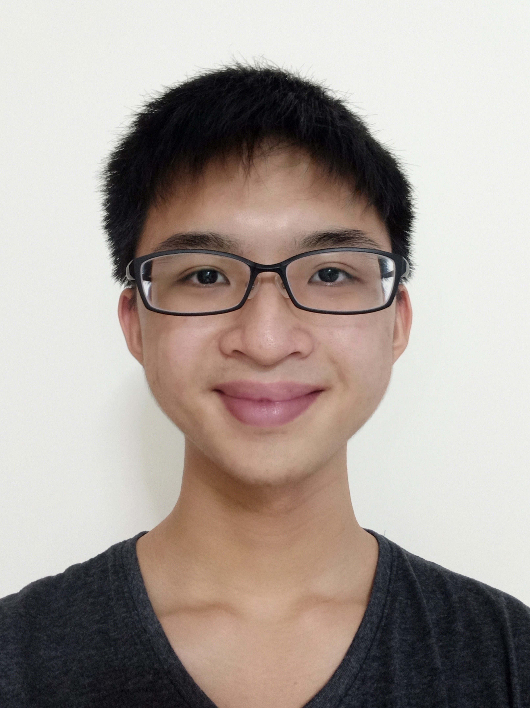
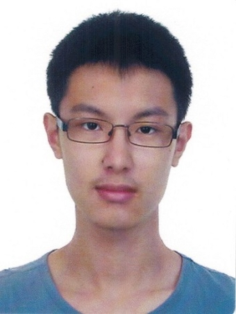
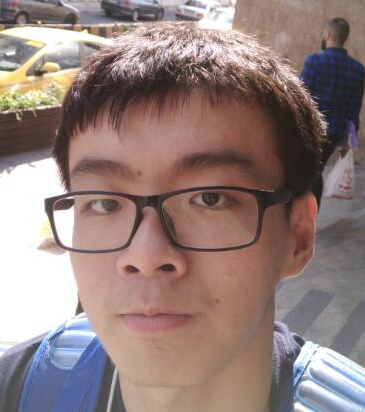

We are a team based in the [School of Computing, National University of Singapore](http://www.comp.nus.edu.sg).

## Project team

### Wayne Tee

[[github](http://github.com/waynetee)]
[[portfolio](team/waynetee.md)]

* Role: Developer
* Responsibilities: Testing + UI

### Elizabeth Chow

[[github](http://github.com/lizchow)]
[[portfolio](team/lizchow.md)]

* Role: Developer
* Responsibilities: Scheduling and tracking of deadline, Model

### Sun Jia Cheng

[[github](http://github.com/sunjc826)] [[portfolio](team/sunjc826.md)]

* Role: Developer
* Responsibilities: Documentation + Models

### Wong Pei Xian

[[github](http://github.com/trxe)]
[[portfolio](team/trxe.md)]

* Role: Developer
* Responsibilities: Code Quality + Logic

### Zhang Guangxuan

[[github](https://github.com/guangxuan)]
[[portfolio](team/guangxuan.md)]

* Role: Developer
* Responsibilities: Integration + Storage
