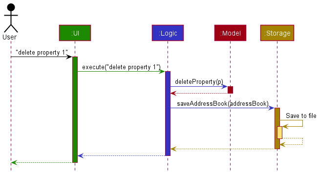
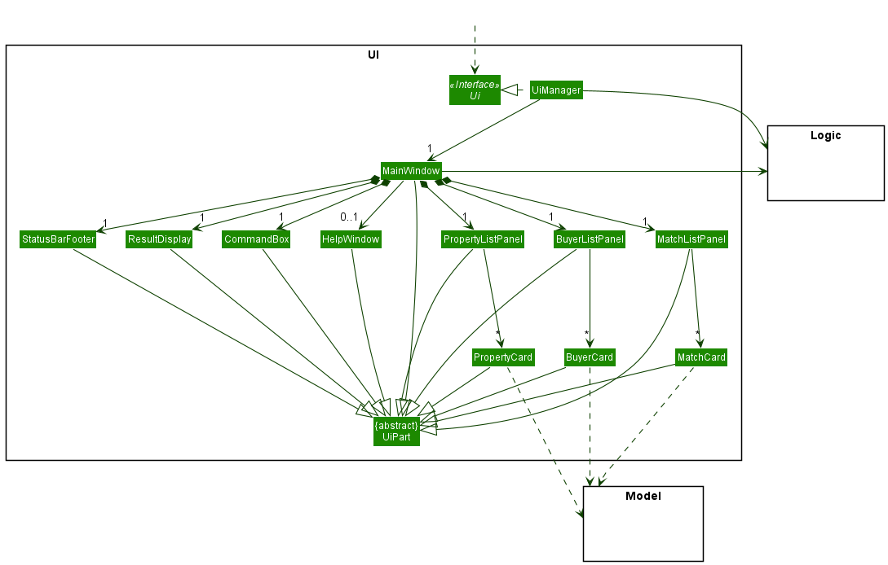
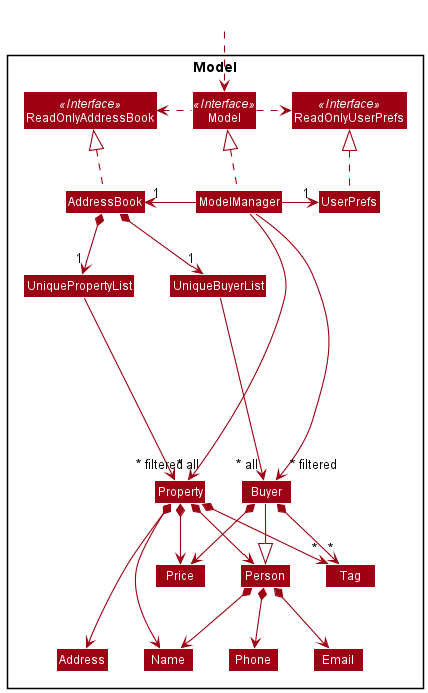
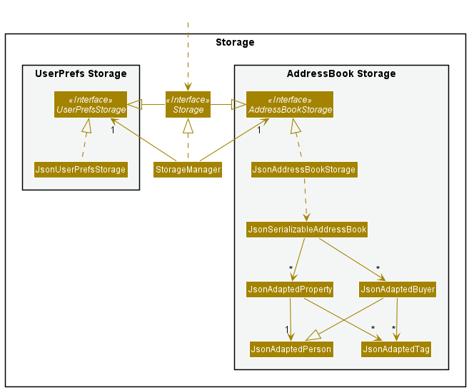
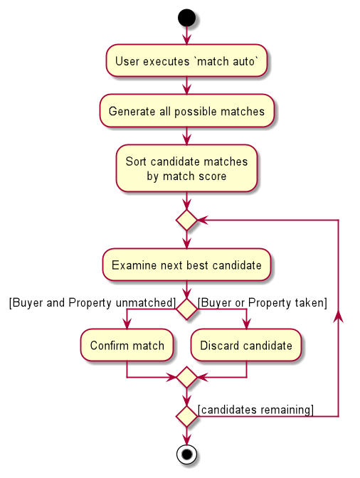
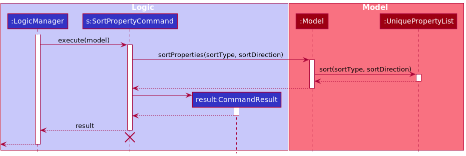
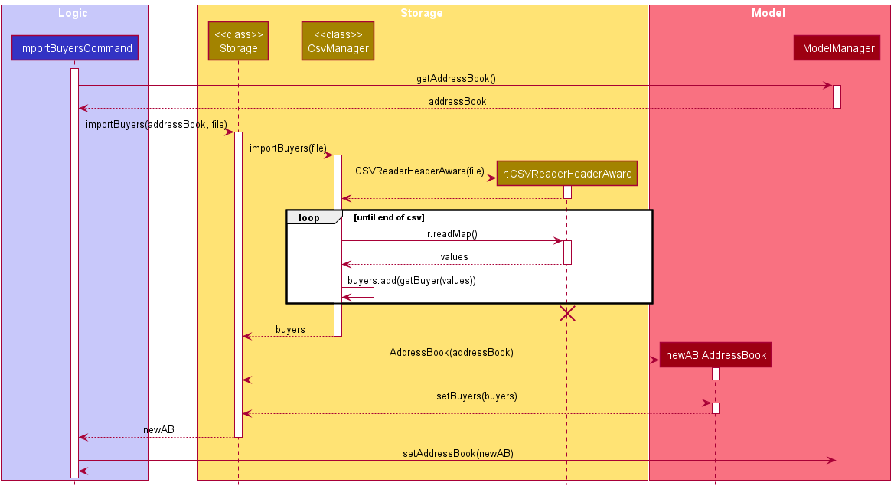
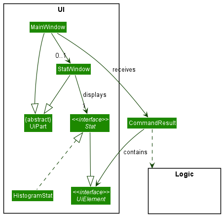

* Table of Contents
{:toc}

--------------------------------------------------------------------------------------------------------------------

## **Acknowledgements**

* [opencsv](http://opencsv.sourceforge.net/) for providing an API to read, parse and write csv files.
* [JFreeChart](https://www.jfree.org/jfreechart/) for providing the API to display statistics and charts.
* [JavaFX](https://gluonhq.com/products/javafx/) for providing the API to render GUI.
* [Jackson](https://github.com/FasterXML/jackson) for providing the API to parse JSON files.

--------------------------------------------------------------------------------------------------------------------

## **Setting up, getting started**

Refer to the guide [_Setting up and getting started_](SettingUp.md).

--------------------------------------------------------------------------------------------------------------------

## **Design**

:bulb: **Tip:** The `.puml` files used to create diagrams in this document can be found in the [diagrams](https://github.com/AY2122S1-CS2103T-W11-4/tp/tree/master/docs/diagrams/) folder. Refer to the [_PlantUML Tutorial_ at se-edu/guides](https://se-education.org/guides/tutorials/plantUml.html) to learn how to create and edit diagrams.

### Architecture

The ***Architecture Diagram*** given above explains the high-level design of the App.

Given below is a quick overview of main components and how they interact with each other.

**Main components of the architecture**

**`Main`** has two classes called [`Main`](https://github.com/AY2122S1-CS2103T-W11-4/tp/blob/master/src/main/java/seedu/address/Main.java) and [`MainApp`](https://github.com/AY2122S1-CS2103T-W11-4/tp/blob/master/src/main/java/seedu/address/MainApp.java). It is responsible for,
* At app launch: Initializes the components in the correct sequence, and connects them up with each other.
* At shut down: Shuts down the components and invokes cleanup methods where necessary.

[**`Commons`**](#common-classes) represents a collection of classes used by multiple other components.

The rest of the App consists of four components.

* [**`UI`**](#ui-component): The UI of the App.
* [**`Logic`**](#logic-component): The command executor.
* [**`Model`**](#model-component): Holds the data of the App in memory.
* [**`Storage`**](#storage-component): Reads data from, and writes data to, the hard disk.

**How the architecture components interact with each other**

The *Sequence Diagram* below shows how the components interact with each other for the scenario where the user issues the command `delete property 1`.

Each of the four main components (also shown in the diagram above),

* defines its *API* in an `interface` with the same name as the Component.
* implements its functionality using a concrete `{Component Name}Manager` class (which follows the corresponding API `interface` mentioned in the previous point.

For example, the `Logic` component defines its API in the `Logic.java` interface and implements its functionality using the `LogicManager.java` class which follows the `Logic` interface. Other components interact with a given component through its interface rather than the concrete class (reason: to prevent outside component's being coupled to the implementation of a component), as illustrated in the (partial) class diagram below.

The sections below give more details of each component.

### UI component

The **API** of this component is specified in [`Ui.java`](https://github.com/AY2122S1-CS2103T-W11-4/tp/blob/master/src/main/java/seedu/address/ui/Ui.java)

The UI consists of a `MainWindow` that is made up of parts e.g.`CommandBox`, `ResultDisplay`, `PropertyListPanel`, `StatusBarFooter` etc. All these, including the `MainWindow`, inherit from the abstract `UiPart` class which captures the commonalities between classes that represent parts of the visible GUI.

The `UI` component uses the JavaFx UI framework. The layout of these UI parts are defined in matching `.fxml` files that are in the `src/main/resources/view` folder. For example, the layout of the [`MainWindow`](https://github.com/AY2122S1-CS2103T-W11-4/tp/blob/master/src/main/java/seedu/address/ui/MainWindow.java) is specified in [`MainWindow.fxml`](https://github.com/AY2122S1-CS2103T-W11-4/tp/blob/master/src/main/resources/view/MainWindow.fxml)

The `UI` component,

* executes user commands using the `Logic` component.
* listens for changes to `Model` data so that the UI can be updated with the modified data.
* keeps a reference to the `Logic` component, because the `UI` relies on the `Logic` to execute commands.
* depends on some classes in the `Model` component, as it displays `Property` and `Buyer` objects residing in the `Model`.

### Logic component

**API** : [`Logic.java`](https://github.com/AY2122S1-CS2103T-W11-4/tp/blob/master/src/main/java/seedu/address/logic/Logic.java)

Here's a (partial) class diagram of the `Logic` component:

How the `Logic` component works:
1. When `Logic` is called upon to execute a command, it uses the `AddressBookParser` class to parse the user command.
2. This results in a `Command` object (more precisely, an object of one of its subclasses e.g., `ListCommand`) which is executed by the `LogicManager`.
   Some subclassed commands are themselves abstract (e.g. `AddCommand` is an abstract subclass of `Command`, and `AddPropertyCommand` is a concrete subclass of the `AddCommand`. In this case, an instance of `AddPropertyCommand` will be created).
3. The command can communicate with the `Model` when it is executed (e.g. to add a property).
4. The result of the command execution is encapsulated as a `CommandResult` object which is returned back from `Logic`.

The Sequence Diagram below illustrates the interactions within the `Logic` component for the `execute("delete property 1")` API call.

:information_source: **Note:** The lifeline for `DeleteCommandParser` should end at the destroy marker (X) but due to a limitation of PlantUML, the lifeline reaches the end of diagram.

Here are the other classes in `Logic` (omitted from the class diagram above) that are used for parsing a user command:

How the parsing works:
* When called upon to parse a user command, the `AddressBookParser` class creates an `XYZCommandParser` (`XYZ` is a placeholder for the specific command name e.g., `AddCommandParser`) which uses the other classes shown above to parse the user command and create a `XYZCommand` object (e.g., `AddCommand`) which the `AddressBookParser` returns back as a `Command` object.
* All `XYZCommandParser` classes (e.g., `AddCommandParser`, `DeleteCommandParser`, ...) inherit from the `Parser` interface so that they can be treated similarly where possible e.g, during testing.

### Model component
**API** : [`Model.java`](https://github.com/AY2122S1-CS2103T-W11-4/tp/blob/master/src/main/java/seedu/address/model/Model.java)

The `Model` component,

* stores the address book data i.e., all `Property`, `Buyer` and `Match` objects (which are contained in a `UniquePropertyList` (resp. `UniqueBuyerList`, `UniqueMatchList`) object).
* stores the currently 'selected' `Property` and `Buyer` objects (e.g., results of a search query) as a separate _filtered_ list which is exposed to outsiders as an unmodifiable `ObservableList<Property>` (resp. `ObservableList<Buyer>`) that can be 'observed' e.g. the UI can be bound to this list so that the UI automatically updates when the data in the list change.
* stores a `UserPref` object that represents the user’s preferences. This is exposed to the outside as a `ReadOnlyUserPref` objects.
* does not depend on any of the other three components (as the `Model` represents data entities of the domain, they should make sense on their own without depending on other components)

### Storage component

**API** : [`Storage.java`](https://github.com/AY2122S1-CS2103T-W11-4/tp/blob/master/src/main/java/seedu/address/storage/Storage.java)

The `Storage` component,
* can save both address book data and user preference data in json format, and read them back into corresponding objects.
* inherits from both `AddressBookStorage` and `UserPrefStorage`, which means it can be treated as either one (if only the functionality of only one is needed).
* depends on some classes in the `Model` component (because the `Storage` component's job is to save/retrieve objects that belong to the `Model`)

### Common classes

Classes used by multiple components are in the `seedu.addressbook.commons` package.

--------------------------------------------------------------------------------------------------------------------

## **Implementation**

This section describes some noteworthy details on how certain features are implemented.

### One to many matching between properties and buyers

This family of commands all extend from the abstract `MatchOneToManyCommand` class. 
* The `MatchPropertyCommand` class matches 1 property to many buyers. It is triggered when the user enters the `match property INDEX` command.
* The `MatchBuyerCommand` class matches 1 buyer to many properties. It is triggered when the user enters the `match buyer INDEX` command.

Due to the highly symmetrical nature of these 2 commands, only `MatchPropertyCommand` will be elaborated upon.

The property to be matched with buyers is chosen by index based on the currently visible list of properties. The potential buyer matches are taken from the currently visible list of buyers. There may be buyers in the address book that are not being displayed, perhaps due to a currently active filter. Such buyers will not be taken into consideration when conducting the matching. The rationale for this is so that the `match` command's output is predictable.

Given a property, the algorithm first aims to filter out the incompatible matches, then outputs a sorted list of compatible buyers ordered by decreasing desirability. A buyer is compatible with a property if the buyer's budget is greater than or equal to the property's selling price. If a buyer can afford a property, then the level of desirability is determined by the number of tags that the buyer and the property have in common.

The sequence diagram below shows the algorithm at work. 

1. The algorithm first retrieves the currently visible property list and selects the property `p` to be matched using the `targetIndex` attribute of `MatchPropertyCommand`.
2. The algorithm creates a property filter `pp` to only show `p` in the visible property list. The rationale here is so that the user can clearly see which property the buyers are matched to.
3. The algorithm creates a buyer filter `bp` to select only the buyers whose `maxPrice` attribute (budget) is greater than or equal to the `price` attribute (selling price) of the property `p`.
4. The algorithm creates a comparator `bc` to which will be used later to sort the filtered buyers. Buyers with more tags in common with `p` will come first. Amongst buyers with the same number of tags in common, buyers with a higher budget will come first.
5. The algorithm calls the `model` to update the visible property list with predicate `pp` and updates the visible buyer list with predicate `bp` and comparator `bc`.

Please refer to the `MatchOneToManyCommand`, `MatchPropertyCommand`, `MatchBuyerCommand` classes for the full details of the implementation.

#### Design considerations:
As mentioned above, only `MatchPropertyCommand` will be elaborated upon, hence these design considerations are discussed in the context of matching one property to many buyers.

**Aspect: Displaying property after match**
* **Alternative 1 (current choice)**: Display only the property to be matched, so that the resulting property list only has 1 visible property.
    * Pros: Easy to implement. Also, this is less distracting for the user as there are no other properties displayed to cause confusion.
    * Cons: In the current UI implementation, there is wastage of space as the property side of the display only has 1 property list item, and the property box is mostly empty.
* **Alternative 2**: Continue to display all the previously visible properties, and bring the property to be matched to the top of the list. Additionally, extra CSS classes and styles are added to the list item containing the property to be matched for emphasis.
    * Pros: No space is wasted as the original visible list is retained. Additionally, this can be more convenient. The user can enter `match property INDEX`, choosing to match another property without needing to reset the property list via the `list` command.
    * Cons: More difficult to implement as it requires additional UI flourishes. Even with the CSS classes and styles added for emphasis, the resulting display may still be visually messy and negatively impact the user experience.

**Aspect: One-to-many matching algorithm**
* **Alternative 1 (current choice)**: Filter out buyers whose budgets are below property's selling price.
    * Pros: Easily testable implementation.
    * Cons: The criteria may be too strict as in real life, there can be negotiations that can change the selling price of a property, or the price a buyer is willing to pay. 
* **Alternative 2**: Allow matches between buyers and sellers even when the buyer's budget is below the property's selling price.
    * Pros: A more realistic implementation.
    * Cons: More difficult to test.

Comments: **Alternative 2** is the approach taken by the intelligent matching algorithm explained below. The intelligent matching algorithm reflects a less rigid, more heuristic focused matching philosophy and aims to attain a "smarter" matching.

### Intelligent matching of properties and buyers

The intelligent matching feature performs a one-to-one matching of buyers to properties based on price and tags in common. This section describes the algorithm and explains its rationale.

This matching is done by the `MatchAutoCommand` class, and is triggered when the user enters the `match auto` command. The algorithm takes in the currently visible list of properties and buyers, and outputs a list of buyer-property matches. Note that each buyer is matched to at most one property and vice versa.

The goal of the algorithm is to allow the user to discover compatible buyers and properties. Compatibility is determined by a _Match Score_, which is calculated based on the number of tags the buyer and property have in common, as well as the buyer's budget and property price.

The activity diagram below illustrates the algorithm:

1. The algorithm generates all possible pairs between the list of buyers and properties.
2. The algorithm sorts all these candidate matches by the match score.
3. Starting with the match with the highest score, the algorithm accepts each match whose buyer and property have not been previously matched. This continues until all candidate matches are evaluated.
4. The list of accepted matches is then returned to the UI to be displayed.

Please refer to the `MatchAutoCommand` and `Match` classes for the full details of the implementation, including the calculation of the _Match Score_.

#### Design considerations:

**Aspect: Matching Output**

* **Alternative 1 (current choice):** One-to-one matching between properties and buyers.
    * Currently, each buyer is matched to at most one property and vice versa.
    * Pros: Easier for users to comprehend.
    * Cons: Displays less information to users.

* **Alternative 2:** Many-to-many matching
    * Alternatively, each buyer and property can be simultaneously matched to many others.
    * Pros: Potentially convey more information to the user.
    * Cons: Harder for users to comprehend and navigate the information.

We decided to go with Alternative 1 as we prioritized presenting a simpler and more intuitive output to our users.

**Aspect: Matching algorithm**

* **Alternative 1 (current choice):** Prioritize top matches
    * The current algorithm selects matches starting with the best possible match. This optimizes for the compatibility of the first few matches.
    * Pros: First few matches are likely to be very compatible.
    * Cons: Last few matches are likely to be poor.

* **Alternative 2:** Prioritize overall fairness of matches
    * An alternative algorithm might optimise for the number of acceptable matches.
    * Pros: Allows more buyers to be matched with acceptable properties.
    * Cons: First few matches may not be as compatible as Alternative 1.

We chose Alternative 1 as we expect the user to focus on the top matches, hence we optimized for those.

### Sort feature
The sort feature allows the user to sort the properties and buyers in PropertyWhiz.
The feature consists of the following commands:
* `sort properties` - Sorts the properties in PropertyWhiz.
* `sort buyers` - Sorts the buyers in PropertyWhiz.

There are 2 sorting options in PropertyWhiz:
* `SortType` - Enum class that represents the attributes of buyers and properties that can be sorted. Currently, only names and prices of buyers and properties can be sorted. These are represented by `SortType.NAME` and `SortType.PRICE` respectively.
* `SortDirection` - Enum class that represents the direction, ascending or descending, of the sort. These are represented by `SortDirection.ASC` and `SortDirection.DESC`.

#### Parsing of commands
The parsing of commands is done in the `LogicManager` and when executed, which results in `SortCommand` object being created. 
Since both properties and buyers can be sorted, `SortCommand` is abstract and `SortPropertyCommand` and `SortBuyerCommand`are concrete subclasses that extend `SortCommand`.
The `SortCommandParser` serves as the intermediate layer between `LogicManager` and `SortCommand` to handle parsing of arguments of the user sort command. 

Given below are the steps to parse a sort user command:

Step 1. `AddressBookParser` will check if the command is a sort command. The `AddressBookParser` will then create a `SortCommandParser`.

Step 2. `SortCommandParser` will parse the arguments of the command to get the list, sort type and sort direction to be sorted by calling static methods in `ParserUtil`.

Step 3. Depending on the list to be sorted, the corresponding subclass of `SortCommand` will be created:
   * `sort properties <args>`: `SortPropertyCommand`
   * `sort buyers <args>`: `SortBuyerCommand`

   The user input for types of `<args>` can be found in the [UserGuide](UserGuide.md#sorting-propertiesbuyers-sort).

Given below is a sequence diagram for execution of `execute("sort properties price asc")` in the `Logic` component.

:information_source: **Note:** The lifeline for `SortCommandParser` should end at the destroy marker (X) but due to a limitation of PlantUML, the lifeline reaches the end of diagram.

#### Execution of commands
After parsing of the user input into a `SortCommand`, the `LogicManager` calls `SortCommand#execute`.

The `Model` interface exposes the following operations to sort the buyers and properties list:
* `Model#sortProperties(sortType, sortDirection)`
* `Model#sortBuyers(sortType, sortDirection)`

`ModelManager` implements the the `Model` interface. `SortPropertyCommand` will call `ModelManager#sortProperties` and `SortBuyerCommand` will call `ModelManager#sortBuyers` with the given `SortType` and `SortDirection`.

`ModelManager` will call methods of the encapsulated `AddressBook`: `ModelManager#sortProperties` calls `AddressBook#sortProperties` and  `ModelManager#sortBuyers` calls `AddressBook#sortBuyers`.

`AddressBook#sortProperties` will call `UniquePropertyList#sort` and `Address#sortBuyers` will call `UniqueBuyerList#sort` to sort the currently displayed properties or buyers respectively.

Lastly, a `CommandResult` object containing the message to be displayed to the user is created and returned to the `LogicManager`.

Given below is a sequence diagram for the execution of a `SortPropertyCommand`.

:information_source: **Note:** The lifeline for `SortPropertyCommand` should end at the destroy marker (X) but due to a limitation of PlantUML, the lifeline reaches the end of diagram.

#### Design considerations:
**Aspect: Implementation of `SortPropertyCommand#execute`** 
* **Alternative 1 (current choice)**: Pass the `SortType` and `SortDirection` from the `SortCommand` to the `Model`.
  * Pros: Easy to implement.
  * Cons: Need to pass the arguments through many layers before reaching `UniquePropertyList`.
* **Alternative 2** : Implement many methods in the `Model` to represent the different combinations of sort types and directions and call these methods directly in `SortCommand#execute(model)`.
  * Pros: Better abstraction.
  * Cons: Too many different combinations, and as a result, too many methods in the `model`, if there is a need to extend the sort options in the future.

### Import feature

The import feature imports from a csv file of buyers/properties chosen by the user, to the AddressBook. 

[opencsv](http://opencsv.sourceforge.net/) is a simple library for reading and writing CSV in Java. PropertyWhiz uses opencsv when importing (and exporting) csv files.

Given below are the steps for importing buyers from a csv file:
1. The user executes `import buyer`. The `import` command is parsed by `AddressBookParser#getCommandPreAction`, returning a `CommandPreAction` that indicates a file is required for `import`.
2. `MainWindow#getCsvFile` creates a `FileChooserDialog`. The user selects a csv file to import from disk.
3. `AddressBookParser#parseCommandWithFile` parses `import buyer` and creates a `ImportBuyersCommand`.

Given below are the steps for executing `ImportBuyersCommand`:
1. `LogicManager` calls `ImportBuyersCommand#execute` with the file selected by the user.
2. `ImportBuyersCommand#execute` calls `Storage#importBuyers` with the current `AddressBook` and file.
3. `Storage#importBuyers` calls `CsvManager#importBuyers` with the given file.
4. `CsvManager#importBuyers` creates a new `CSVReaderHeaderAware` to read the CSV headers.
5. `CSVReaderHeaderAware` parses each row in the csv file, to create a new `Buyer` object. `CsvManager#importBuyers` collects `Buyer` objects into a list, then returns the list of `Buyer`.
6. Upon receiving list of `Buyer`, `Storage#importBuyers` creates then returns a new `AddressBook` containing original and imported buyers.
7. Upon receiving an `AddressBook`, `ImportBuyersCommand#execute` replaces the current `AddressBook` in `ModelManager`.

Given below is a sequence diagram for the execution of `ImportBuyersCommand`.

#### Design considerations:
**Aspect: Implementation of `CsvManager#importBuyers`**
* **Alternative 1 (current choice)**: Use a `CSVReaderHeaderAware` to parse the csv rows.
    * Pros: Easy to implement, especially without specialized knowledge on `opencsv`.
    * Cons: `CsvManager` becomes bloated with functions to build objects from parsed rows.
* **Alternative 2** : Create csv-adapted objects (beans) for parsing. Use `opencsv` beans to parse rows.
    * Pros: Better abstraction.
    * Cons: Greater overhead (runtime, memory, human effort) in maintaining multiple types of the same object: `Buyer`, `JsonAdaptedBuyer`, and `BuyerBeans`.

### Statistics Diagram Pop-ups

#### Implementation

The mechanism for handling and presenting statistics is facilitated by the classes implementing `Stat`.

[JFreeChart](https://www.jfree.org/jfreechart/) is the third-party library used to generate charts in the
program. If more charts are to be implemented in the future, JFreeChart supports a wide range of graphing
and chart drawing capabilities, as can be seen from its 
[API](https://www.jfree.org/jfreechart/javadoc/index.html) here.

Currently the only type of diagram supported is a price histogram of the visible properties and/or buyers,
facilitated by `HistogramStat` in the subpackage `seedu.address.ui.stats`.

The `CommandResult` class now includes an attribute that contains an `Optional<UiElement>` that contains
an element that a `UiPart` can handle the rendering of.

The following class diagram shows the relationship between classes used to implement this feature.

Given below is an example usage scenario and how the statistics diagram is generated and then presented.

Step 1. The user executes `stat property` to display the statistics of the properties on screen. The `stat` command is parsed by `AddressBookParser#parseCommand`, which creates
a `StatCommandParser` which parses the argument `property` passed to it.

Step 2. `StatCommandParser` identifies if the user want to show the prices for buyers, properties or both, and creates a `StatCommand` which creates
a `Stat` object that is passed via a `CommandResult` to the MainWindow.

:information_source: **Note:** The `Stat` interface implements the `Stat#create` method that creates a `JFreeChart`. 

Step 3. Upon receiving the `Stat` object, the `MainWindow` creates the `JFreeChart` to be presented by calling `Stat#create`, before passing the chart to `StatWindow`.

Step 4. `StatWindow` updates the statistics window with the latest `JFreeChart` it has received.

#### Future extensions:

Currently the `stat` command only displays a price histogram with a fixed number of 10 bins (columns).
Here are several extensions that can be implemented in the future:

1. Allow the user to enter how many bins they want to see in the histogram.

1. Allow the user to choose between different types of charts.

#### Design considerations:

**Aspect: How to create the `JFreeChart` histogram's dataset before `ChartFactory` creates the chart:**

* **Alternative 1:** Use the `HistogramDataset` class to automatically generate the dataset.
    * Pros: Easy to implement.
    * Cons: JFreeChart's default dataset generated by `HistogramDataset` has many visual bugs with small datasets.

* **Alternative 2 (current choice):** Create a fixed number of `SimpleHistogramBins`, rendered by a `BarRenderer`.
    * Pros: Less visual bugs, finer control of graph visuals.
    * Cons: More verbose code, may have a greater performance hit when dealing with larger datasets.

--------------------------------------------------------------------------------------------------------------------

## **Documentation, logging, testing, configuration, dev-ops**

* [Documentation guide](Documentation.md)
* [Testing guide](Testing.md)
* [Logging guide](Logging.md)
* [Configuration guide](Configuration.md)
* [DevOps guide](DevOps.md)

--------------------------------------------------------------------------------------------------------------------

## **Appendix: Requirements**

### Product scope

**Target user profile**:

* Property agents who need to manage a significant number of properties and buyers
* Prefer desktop apps
* Can type fast
* Prefers typing to mouse interactions
* Is reasonably comfortable using CLI apps

**Value proposition**: Allow property agents to manage and match properties and buyers faster than a typical mouse/GUI driven app.

### User stories

Priorities: High (must have) - `H`, Medium (nice to have) - `M`, Low (unlikely to have) - `L`

| Priority | As a …​                                    | I want to …​                     | So that I can…​                                                        |
| ---- | ------------------------------------------ | ------------------------------ | -------------------------------------------------------------------------- |
| `H`  | new user                                   | see usage instructions         | refer to instructions when I forget how to use the App                     |
| `H`  | user                                       | add a property                 | keep track of the property                                                 |
| `H`  | user                                       | delete a property              | stop keeping track of the property                                         |
| `H`  | user                                       | edit property details          | edit details directly instead of deleting and adding                       |
| `H`  | user                                       | list all properties            | easily see all properties                                                  |
| `H`  | user                                       | find property by name          | locate details of property without having to go through the entire list    |
| `H`  | user                                       | update property tags           | provide details about a property                                           |
| `H`  | user                                       | find property by tags          | easily see related properties with a given tag                             |
| `H`  | user                                       | add a buyer                    | keep track of the buyer                                                    |
| `H`  | user                                       | delete a buyer                 | stop keeping track of the buyer                                            |
| `H`  | user                                       | edit buyer details             | edit details directly instead of deleting and adding                       |
| `H`  | user                                       | list all buyers                | easily see all buyers                                                      |
| `H`  | user                                       | update buyer tags              | provide details about a buyer                                              |
| `H`  | user                                       | find buyer by tags             | easily see related buyers with a given tag                                 |
| `H`  | user                                       | sort properties by price       | easily see the cheapest or most expensive properties                       |
| `H`  | user                                       | sort buyers by budget          | easily see the buyers with highest or lowest budgets                       |
| `H`  | user                                       | match properties to given buyer| see all properties that are suitable for a buyer                           |
| `H`  | user                                       | match buyers to given property | see all buyers that are suitable for a property                            |
| `H`  | user                                       | match buyers to property 1-to-1| see most suitable matches between buyers and properties                    |
| `M`  | multi-platform user                        | import data from csv file      | migrate data from other apps such as Excel to PropertyWhiz                 |
| `M`  | multi-platform user                        | export data to csv file        | migrate data from PropertyWhiz to other apps such as Excel                 |
| `M`  | user                                       | show histogram for properties prices| see the distribution of prices among properties                       |
| `M`  | user                                       | show histogram for buyer budgets| see the distribution of budgets among buyers                              |
| `L`  | user                                       | show pie chart for property tags| see the distribution of tags among properties                             |
| `L`  | user                                       | show pie chart for buyer tags  | see the distribution of tags among buyers                                  |

### Use cases

(For all use cases below, the **System** is the `PropertyWhiz` and the **Actor** is the `user`, unless specified otherwise)

**Use case: UC01 - Add property/buyer**

**MSS**

1. `User` requests a property/buyer to be added by specifying its details.
2. `PropertyWhiz` adds the property/buyer.

Use case ends.

**Extensions**

* 1a. The given details are in an incorrect format.
    * 1a1. `PropertyWhiz` shows an error message as well as the correct input format.

  Use case ends.

* 1b. Details are in correct format, but the property/buyer already exists in `PropertyWhiz`.
    * 1b1. `PropertyWhiz` shows an error message.

  Use case ends.

_________________

**Use case: UC02 - Delete property/buyer**

**MSS**

1. `User` requests to delete a specific property/buyer by specifying its index.
2. `PropertyWhiz` deletes the property/buyer.

Use case ends.

**Extensions**

* 1a. The index is invalid.
    * 1a1. `PropertyWhiz` shows an error message.

  Use case ends.

_________________

**Use case: UC03 - Edit property/buyer**

**MSS**

1. `User` requests to modify a property/buyer by specifying its index and new details.
2. `PropertyWhiz` edits attributes of the property/buyer.

Use case ends.

**Extensions**

* 1a. The index is invalid.
    * 1a1. `PropertyWhiz` shows an error message.

  Use case ends.

* 1b. `User` does not provide new attributes.
    * 1b1. `PropertyWhiz` shows an error message.

  Use case ends.

* 1c. Edited property/buyer already exists as another property/buyer in `PropertyWhiz`.
    * 1c1. `PropertyWhiz` shows an error message.

  Use case ends.

_________________

**Use case: UC04 - Edit property/buyer tags**

**MSS**

1. `User` requests to override all tags, add, or delete tags of a property/buyer by specifying its index and tag details.
2. `PropertyWhiz` override all tags, adds or deletes tags of the property/buyer.

Use case ends.

**Extensions**

* 1a. The index is invalid.
    * 1a1. `PropertyWhiz` shows an error message.

    Use case ends.

* 1b. User requests to both override all tags, and add/delete tags.
    * 1b1. `PropertyWhiz` shows an error message.

    Use case ends.

* 1c. User requests to simultaneously chooses to add and delete the same tag.
    * 1c1. `PropertyWhiz` shows an error message.

    Use case ends.

* 1d. User requests to add a tag that is already present or delete a tag that is absent.
    * 1d1. `PropertyWhiz` warns the user about the tag's presence (in the case of add tag) or absence (in the case of delete tag).

    Use case resumes from step 2.

_________________

**Use case: UC05 - Find properties/buyers**

**MSS**

1. `User` requests to find properties/buyers by specifying keywords, tags or price range.
2. `PropertyWhiz` displays properties/buyers that fulfill the criteria.

Use case ends.

_________________

**Use case: UC06 - Import properties/buyers**

**MSS**

1. `User` requests to import properties/buyers.
2. `User` chooses the source CSV file.
3. `PropertyWhiz` imports the properties/buyers from the source file.

Use case ends.

**Extensions**

* 1a. `User` cancels while choosing a CSV file.
    * 1a1. `PropertyWhiz` reports that import has been cancelled.

    Use case ends.

* 2a. The CSV file cannot be opened or read from.
    * 2a1. `PropertyWhiz` shows an error message.

    Use case ends.

* 2b. The CSV file is incorrectly formatted.
    * 2b1. `PropertyWhiz` shows an error message.

    Use case ends.

* 2c. Importing creates duplicates within `PropertyWhiz`.
    * 2c1. `PropertyWhiz` shows an error message.

    Use case ends.

_________________

**Use case: UC07 - Export properties/buyers**

**MSS**

1. `User` requests to export properties/buyers.
2. `User` chooses the destination CSV file.
3. `PropertyWhiz` exports displayed properties/buyers to the CSV file.

Use case ends.

**Extensions**

* 1a. `User` cancels while choosing a CSV file.
    * 1a1. `PropertyWhiz` reports that export has been cancelled.

    Use case ends.

* 2a. The CSV file cannot be opened or written to.
    * 2a1. `PropertyWhiz` shows an error message.

    Use case ends.

_________________

**Use case: UC08 - Match auto**

**MSS**

1. `User` requests to match properties to buyers 1-to-1.
2. `PropertyWhiz` displays 1-to-1 matching between properties and buyers.

Use case ends.

**Extensions**

* 1a. There are either no properties, or no buyers.
    * 1a1. `PropertyWhiz` shows an error message.

    Use case ends.

_________________

**Use case: UC09 - Charting**

**MSS**

1. `User` requests to for a chart of prices of properties/buyers.
2. `PropertyWhiz` draws and displays chart showing prices of properties/buyers.

Use case ends.

### Non-Functional Requirements

1. Should work on any _mainstream OS_ as long as it has Java `11` or above installed.
2. Should be able to hold up to 200 properties and buyers without a noticeable sluggishness in performance for typical usage.
3. A user with above average typing speed for regular English text (i.e. not code, not system admin commands) should be able to accomplish most of the tasks faster using commands than using the mouse.
4. Should be able to function without internet access.
5. Should be able to restart without loss of data.
6. Should be packaged within a single JAR file, without requiring an installer.

### Glossary

* **Mainstream OS**: Windows, Linux, Unix, OS-X
* **Property**: A house or apartment listed for sale
* **Buyer**: A person who expresses interest in a range of properties
* **CSV file**: Comma-separated values file

--------------------------------------------------------------------------------------------------------------------

## **Appendix: Instructions for manual testing**

Given below are instructions to test the app manually.

:information_source: **Note:** These instructions only provide a starting point for testers to work on;
testers are expected to do more *exploratory* testing.

### Launch and shutdown

1. Initial launch

   1. Download the JAR file and copy into an empty folder
   2. Double-click the JAR file 
       Expected: Shows the GUI with a set of sample properties and buyers. The window size may not be optimum.

1. Saving window preferences

   1. Resize the window to an optimum size. Move the window to a different location. Close the window.
   2. Re-launch the app by double-clicking the JAR file. 
       Expected: The most recent window size and location is retained.
   
### Keeping track of properties

1. Add a property
   1. Test case: `add property n/Hasta La Vista a/20 Clementi Ave 2, #02-25 $/1652000 s/John Doe p/98765432 e/johnd@example.com t/Condo t/4 rm t/621 sqft t/EW23 Clementi` 
      Expected: Property successfully added to the top of property list.

2. Edit a property while all properties are being shown
   1. Prerequisites: List all properties using the `list` command.
   2. Test case: `edit property 1` 
      Expected: As no fields are provided, error message is shown.
   3. Test case: `edit property 1 ta/condo1 ta/condo2 ta/condo3 ta/condo4` 
      Expected: 4 new tags `condo1`, `condo2`, `condo3`, `condo4` are added to the first property in the displayed property list. 
3. Deleting a property while all properties are being shown

   1. Prerequisites: List all properties using the `list` command. Multiple properties in the list.

   2. Test case: `delete property 1` 
      Expected: First property is deleted from the list. Details of the deleted property shown.

   3. Test case: `delete property 0` 
      Expected: No property is deleted. Error message shown.

   4. Other incorrect delete commands to try: `delete`, `delete property x` (where x is larger than the list size) 
      Expected: Similar to previous test cases.

4. Sort properties that are in the displayed list
   1. Test case: `sort property name desc` 
      Expected: Sorted all properties in the displayed property list by name in descending order.
   2. Test case: `sort property name` 
      Expected: As there is no sort direction given, error message is shown.

### Exporting and importing data

1. Testing properties export/import CSV
   1. Remove `propertywhiz.json` file in the /data folder.
   2. Run `PropertyWhiz` to obtain an initialized list of properties and buyers.
   3. Enter Command: `export property`, select a CSV file at a convenient location. 
      Expected: CSV file is created, containing a header and 1 property per row.
   4. Enter Command: `clear` to clear existing properties and buyers.
   5. Enter Command: `import property` from the CSV file. 
      Expected: Properties are successfully imported.
   6. Enter Command: `import property` from the CSV file. 
      Expected: Import properties failed due to duplicates.
2. Repeat the commands above to test for buyers.

### Testing multiple commands quickly
1. `PropertyWhiz` allows users to copy and paste multiple commands, with one command on each line. 
   Expected: The first line of command will be displayed in the Command Box.

2. Press enter to run the command in the command box.  
   Expected: The displayed command in the Command Box will be run, and the output will be displayed as per normal.
   The next line containing a command will replace the displayed command, regardless of whether the displayed command was successful.
3. Repeat until all commands are run. After all pasted commands are run, the command box will be emptied instead of being replaced with another command.

:exclamation: **Caution:**
If a command that was previously multi-line pasted is edited then executed, the next and subsequent pasted lines will be ignored.
In other words, `PropertyWhiz` treats the edited command as the last line that has been pasted.

Sample list of interactions: 
<pre><code style="white-space: pre-wrap;">clear
add buyer n/ben p/91234567 e/sam@email.com t/hdb t/3rm $/123
add buyer n/alice p/91234567 e/sam@email.com t/hdb t/3rm $/1000
add property n/Hasta La Vista a/20 Clementi Ave 2, #02-25 $/1652000 s/John Doe p/98765432 e/johnd@example.com t/Condo t/4 rm t/621 sqft t/EW23 Clementi
add property n/Dee Gardens a/Blk 30 Lorong 3 Serangoon Gardens, #07-18 $/3423432 s/Beatrice Yu p/99272758 e/berniceyu@example.com
add property n/Olive Gardens a/Blk 11 Ang Mo Kio Street 74, #11-04 $/6457654 s/Charlotte Oliveiro p/93210283 e/charlotte@example.com t/Condo
edit property 3
delete property 10000
list
find property la
find property dee
list
edit property 1 n/new name
edit property 2 n/Olive Gardens a/Blk 11 Ang Mo Kio Street 74, #11-04 $/6457654 s/Charlotte Oliveiro p/93210283 e/charlotte@example.com t/Condo
export property
delete property 3
edit property 1 ta/condo1 ta/condo2 ta/condo3 ta/condo4
edit property 1 td/condo2 td/condo3
find property t/condo1 t/condo4
add buyer n/Sam p/91234567 e/sam@email.com t/hdb t/3rm $/4444
add buyer n/bob p/91234567 e/sam@email.com t/hdb t/3rm $/2222
add buyer n/tim p/91234567 e/sam@email.com t/condo t/3rm $/4444
add buyer n/tom p/91234567 e/sam@email.com t/condo t/3rm $/10000
export buyer
stat
sort    buyer  price    asc
sort    buyer  name    asc
list
sort    property  name    desc
edit buyer  3 td/3rm ta/4rm
delete buyer 2
sort buyers price desc
match auto
back
clear
match auto
add property n/Olive Gardens a/Blk 11 Ang Mo Kio Street 74, #11-04 $/6457654 s/Charlotte Oliveiro p/93210283 e/charlotte@example.com t/Condo
match auto
add buyer n/tom p/91234567 e/sam@email.com t/condo t/3rm $/10000
match    auto
back
clear
</code></pre>

### Saving data

1. Dealing with missing/corrupted data files
   * Make sure the `PropertyWhiz` is currently not running.
   * Open the `propertywhiz.json` file in the /data folder with your favorite text editor.
   * Remove the first character: `{`.
   * Run `PropertyWhiz`. Since the data file is not in the correct format, `PropertyWhiz` should start without any data.

--------------------------------------------------------------------------------------------------------------------

## **Appendix: Effort**
If AB3 required an implementation effort of 10, `PropertyWhiz`’s implementation effort is 15.

### Challenges faced
* Two major entity types are involved: `Property` and `Buyer`
  * These two classes share certain fields, but are fundamentally different. 
  For example, `Property` contains `Person` but `Buyer` extends from `Person`.
  * Command parers have to work for both `Property` and `Buyer`. We considered several user command formats that can work with both `Property` and `Buyer`,
  and settled on adding `property/properties`, `buyer/buyers` after a command word. 
  * Separate command logic and test, storage is required for `Property` and `Buyer` classes. This greatly increased the workload of implementation and testing. 
* Import and export CSV file commands
  * A new workflow was required for the UI to handle files. We must first parse the command text to check if it requires a file, request for a file if needed, then consider executing the command. 
  * Solution: we added a new type of command- `CommandWithFile` to represent commands that require a file. We then added `CommandPreAction` to indicate that a FileChooserDialog is required for the user to select a file. 
  * `CsvManager` was added as a static, purely functional class. The parsing of CSV files was tricky and involved in multiple exceptions. Careful analysis of cases was required to display an appropriate error message.
  * Here, [opencsv](http://opencsv.sourceforge.net/) played an important role in dealing with the huge number of possible errors while parsing CSV files.
* Intelligent Matching functionality
  * This feature required in-depth consideration of the target users’ priorities. We created a scoring metric based on the number of common tags between the buyer and seller, and the difference of the prices.
  * We then designed a suitable algorithm to determine the best matching.
  * Adding this command required the introduction of multiple UI views as a concept and additional code had to be added to support the switching of views.

### Achievements
* Explored a great number of features with only two entities created by users: `Property` and `Buyer`
* Worked strictly within deadlines given for the project.
