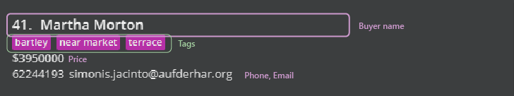
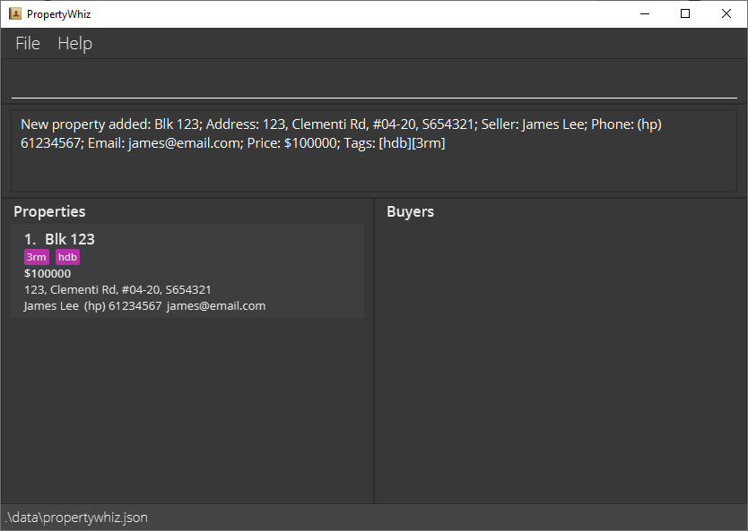
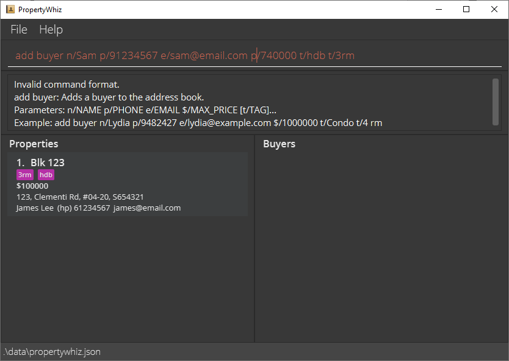
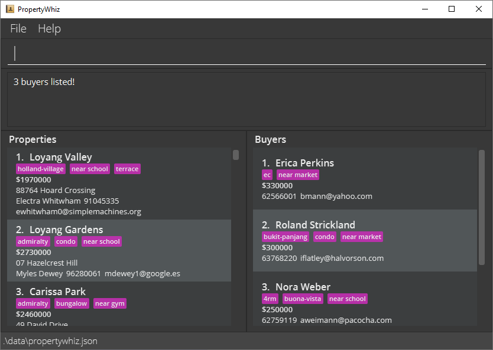
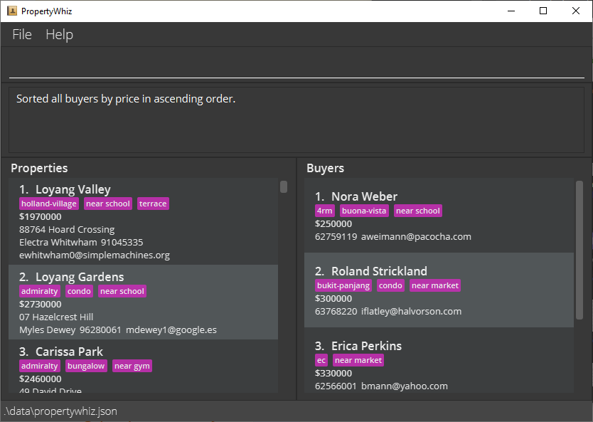
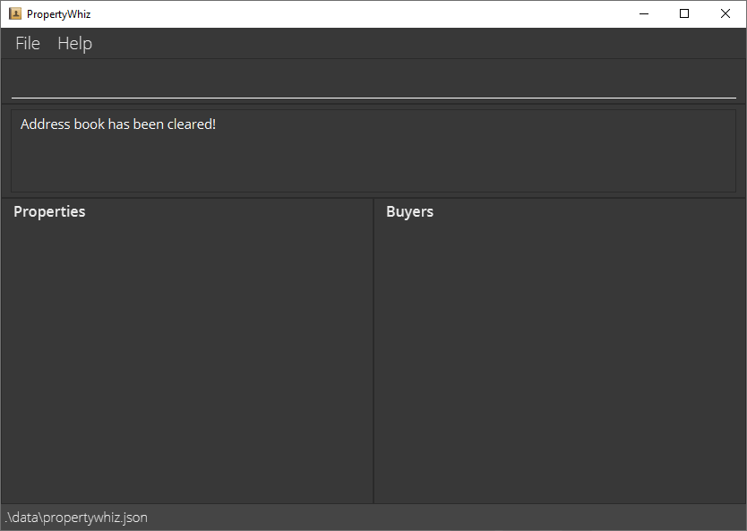

* Table of Contents
{:toc}

--------------------------------------------------------------------------------------------------------------------

## Introduction

PropertyWhiz helps you, a property agent, manage your properties and clients. PropertyWhiz allows you to easily access information, create visualizations, and match your properties to potential buyers.

### Is this for me?

If you fit the descriptions below, then PropertyWhiz will suit you well.

1. Do you face difficulties *managing client information on pen and paper*? With PropertyWhiz, the data you need will always be at your fingertips.
2. Do you fumble with *the complexities of general-purpose software like Microsoft Excel*? PropertyWhiz has a simple yet powerful set of commands purpose-built for you. With a [Command Line Interface (CLI)](#glossary), PropertyWhiz helps you complete your tasks even more efficiently.

### Purpose of this guide

This guide will gently introduce you to the various features offered by PropertyWhiz. Use this guide as a tutorial to get started with PropertyWhiz. When you are proficient, you can still refer back to this document as a reference sheet.

This guide is:
* A summary of all the *features* offered by PropertyWhiz, and provides a high-level overview on how they operate.
* An overview of what *user input* is considered as valid so you can quickly get started with PropertyWhiz.

This guide is **not**:
* An exhaustive case study of all possible ways of using PropertyWhiz's features.
* An exhaustive list of valid and invalid inputs as the application itself will hint you when your input is invalid.

--------------------------------------------------------------------------------------------------------------------

## How to use this guide
Thank you for investing your time to learn more about PropertyWhiz.

Here are some tips on how to read this guide more efficiently, so that you can improve your effectiveness in using PropertyWhiz.

### Navigating the guide

1. First, you can read the [Quick Start](#quick-start) section to check the compatibility of your system with PropertyWhiz. We recommend that you download PropertyWhiz and follow along with the commands introduced in this guide. Practice makes perfect and it is the best way to learn how to use PropertyWhiz!
2. Before going further, do have a glance at the [conventions](#conventions) on symbols and formatting used across this guide. If you see any unfamiliar terminology, fret not, for you can find an explanation in the [glossary](#glossary).
3. Now that you have had an initial look at PropertyWhiz, we have a detailed listing of the user interface (UI) components [here](#navigating-the-user-interface).
   By this step, you may have already tried out some commands in the command box. If you haven't or don't know what the command box is, don't worry! The information is in the UI component listing.
4. Now you are ready to take a deeper dive into our commands. We have some [general guidelines](#valid-propertiesbuyers) on what user input is considered valid. Feel free to look through the detailed descriptions of our [commands](#commands).
5. We have tried our best to make the command format as intuitive and unambiguous as possible. If you have doubts, do refer to our [detailed guide](#command-syntax-guide) on command syntax.

### Conventions

Symbols | Meaning
--------|------------------
:information_source: | This is general information that improves your background understanding of this guide as well as PropertyWhiz.
:bulb: | This is additional (but not crucial) information that may help you to use PropertyWhiz more effectively.
:exclamation: | This is something important that you should be aware of.


Formatting | Meaning
--------|------------------
*italics* | This is used to give slight emphasis to certain words.
**boldface** | This is used to emphasize certain words. The degree of emphasis is stronger than *italics*.
`code` | This is used to denote user input or special text.

--------------------------------------------------------------------------------------------------------------------

## Quick start

<div markdown="block" class="alert alert-info">

**:information_source: Supported platforms:**<br>
If you are using Microsoft Windows, macOS or Linux, then PropertyWhiz is fully compatible with your system. Follow the steps below to get started within minutes.

</div>

1. Ensure you have Java `11` or above installed on your Computer.

2. Download the latest `propertywhiz.jar` file from [here](https://github.com/AY2122S1-CS2103T-W11-4/tp/releases).


3. Copy the file to the folder you want to use as the _home folder_ for your PropertyWhiz.

4. Double-click the file to start the app. The [Graphical User Interface (GUI)](#glossary) similar to below should appear in a few seconds. PropertyWhiz comes with sample data, so you can try out our features right away.<br>
    
   
   
5. PropertyWhiz has a [Command Line Interface (CLI)](#glossary). To tell PropertyWhiz what to do, type a command into the command box at the top and press Enter to execute it. Don't worry if you make a mistake, PropertyWhiz will tell you what went wrong and let you try again.<br>
   Some example commands you can try:

    * **`clear`** : Deletes all properties/buyers. Enter `clear` to start from scratch!

    * **`list`** : Lists all properties/buyers.

    * **`add`** : Adds a property/buyer.
        * e.g. `add property n/Blk 123 a/123, Clementi Rd, #04-20, 1234665 s/James Lee p/61234567 e/example@email.com $/100000 t/HDB t/3rm`

    * **`delete`** : Deletes a property/buyer shown in the current list at the given index.
        * e.g. `delete property 3`
        * e.g. `delete buyer 3`

    * **`exit`** : Exits the app.


6. Be assured that PropertyWhiz saves your data automatically. There is no need to save manually.
7. To learn more about PropertyWhiz, refer to the [Commands](#commands) section below for details of each command, 
   or the [Command Summary](#command-summary).


--------------------------------------------------------------------------------------------------------------------

## Navigating the User Interface


The user interface is split into the input and output sections, as well as
two view columns for **Properties** and **Buyers**.

Item | Description
--------|------------------
**Command box** | This is where you enter your commands to PropertyWhiz. <br> :bulb: For an *unsuccessful* command, the input will be colored <span style="color:red">red</span>.
**Output box** | The output box displays additional information from a command. <br> :bulb: For a *successful* command, the output box may contain information such as the number of entries listed. <br> :bulb: For an *unsuccessful* command, such as invalid input, the output box will give detailed feedback about which part of the command is invalid and how to fix it.
**Properties view** | A list of properties and their details.
**Buyers view** | A list of buyers and their details.

<div style="page-break-after: always;"></div>
Here is the breakdown of an individual *property card*.


Item | Description
--------|------------------
**Name** | Name of property listing.
**Tags** | Tags describing notable qualities of the property.
**Price** | Quoted price of seller.
**Address** | Address of property listing.
**Seller** | Name of seller.
**Phone** | Phone number of seller.
**Email** | Email of seller.

<div style="page-break-after: always;"></div>
Here is the breakdown of an individual *buyer card*.



Item | Description
--------|------------------
**Name** | Name of buyer.
**Tags** | Tags describing the buyer's preferences.
**Budget** | The buyer's budget.
**Phone** | Phone number of buyer.
**Email** | Email of buyer.

--------------------------------------------------------------------------------------------------------------------
<div style="page-break-after: always;"></div>

## Command summary

This section presents an overview of the commands you can give PropertyWhiz. Do refer to the [Command Syntax Guide](#command-syntax-guide) below to learn how to interpret the command formats, and the [Commands section](#commands) for a detailed explanation of each action.

Action | Format
--------|------------------
**Help** | `help`
**Add** | **Property** <br>`add property n/PROPERTY_NAME a/PROPERTY_ADDRESS s/SELLER_NAME p/SELLER_PHONE e/SELLER_EMAIL $/PRICE [t/TAG]…​` <br><br> **Buyer** <br>`add buyer n/BUYER_NAME p/BUYER_PHONE e/BUYER_EMAIL $/BUDGET [t/TAG]…`
**List** | `list`
**Edit** | **Property** <br>`edit property INDEX [n/PROPERTY_NAME] [a/PROPERTY_ADDRESS] [s/SELLER_NAME] [p/SELLER_PHONE] [e/SELLER_EMAIL] [$/PRICE] [([t/TAG]…​ | [ta/TAG_TO_ADD]… [td/TAG_TO_DELETE]…)]​`<br><br> **Buyer** <br> `edit buyer INDEX [n/BUYER_NAME] [p/BUYER_PHONE] [e/BUYER_EMAIL] [$/BUDGET] [([t/TAG]… | [ta/TAG_TO_ADD]… [td/TAG_TO_DELETE]…)]`
**Stat** | `stat [(property | buyer)]`
**Find** | `find (property | buyer) [KEYWORD]… [t/TAG_TO_MATCH]… [$min/MIN_PRICE] [$max/MAX_PRICE]`
**Delete** | `delete (property | buyer) INDEX`
**Sort** | `sort (property | buyer) (price | name) (asc | desc)`
**Match** | `match (auto | property INDEX | buyer INDEX)`
**Import** | `import (property | buyer)`
**Export** | `export (property | buyer)`
**Clear** | `clear`
**Exit** | `exit`

--------------------------------------------------------------------------------------------------------------------

## Command Syntax Guide
This section helps you understand the format of the commands listed above and in the [commands section](#commands). If you find this section difficult to understand, feel free to skip ahead and learn the commands by following the examples given.

* The action keywords `property` and `properties` are interchangeable, and likewise for `buyer` and `buyers`.
  * e.g. `find property Condo` can also be entered as `find properties Condo`.

* Words in `UPPER_CASE` must be replaced with the corresponding field by the user.<br>
  * e.g. in `add property n/PROPERTY_NAME`, `PROPERTY_NAME` is a parameter that can be used as `add property n/Beautiful Condo`.

* `[]` : Items in square brackets are optional.<br>
  * e.g `n/PROPERTY_NAME [t/TAG]` can be used as `n/Beautiful Condo t/condo` or as `n/Beautiful Condo`.

* `…` : Items with `…` after them can be repeated any number of times.<br>
  * e.g. `[t/TAG]…` can be omitted, used once:`t/condo`, twice:`t/condo t/family` or more times.

* `( | )` : Items in round brackets `()` separated by `|` means that you can only choose 1 of the items <br>
  * e.g. `([t/TAG] | [ta/TAG_TO_ADD] [t/TAG_TO_DELETE])` can be used as `t/condo` or `ta/condo td/small condo` but not `t/condo ta/condo` or `t/condo td/small condo`

* Extraneous parameters for commands that do not take in parameters (such as `help`, `list`, `exit` and `clear`) will be ignored.<br>
  * e.g. if the command specifies `help 123`, it will be interpreted as `help`.

------------------
<div style="page-break-after: always;"></div>

## Valid properties/buyers
This section describes the requirements of certain fields.

### Property/buyer names
* Names must only contain alphanumeric characters, spaces and hyphens (`-`).
* Names have a maximum allowed length of 50 and cannot be blank.
* Buyers with identical names are not allowed.

### Property addresses
* Addresses must only contain alphanumeric characters or the following special characters:
  * spaces
  * hyphens (`-`)
  * commas (`,`)
  * semicolons (`;`)
  * hashes (`#`)
* Addresses have a maximum allowed length of 100 and cannot be blank.
* Properties with identical addresses are not allowed.

### Property prices and buyer budget
* Prices must be numbers between 4 and 9 digits (both inclusive).
* Leading zeroes will be ignored. For e.g., `00100` has 5 characters, but it only has 3 digits, not counting the leading 0s. Hence, `00100` is an invalid price.

### Phone numbers
* Phone numbers should only contain alphanumeric characters, hyphens (`-`), parentheses (`()`), plus signs (`+`) and spaces.
* Phone numbers must have at least 3 characters, excluding leading and trailing spaces.
  * Valid: 
    * `9123 4567`
    * `(office) +65 6123 4567`
    * `nil`
  * Invalid:
    * `#123` (contains invalid hash symbol)

### Tags
* Tags are always optional.
* Tags must start with a letter or number, and only contain alphanumeric characters, spaces and hyphens (`-`).
* Tags have a maximum allowed length of 100.

------------------

## Commands

<div markdown="span" class="alert alert-primary">:bulb: **Tip:**

Don't worry if your first few commands fail! PropertyWhiz's [output box](#navigating-the-user-interface) gives detailed feedback and you can try again.

</div>

### Viewing help : `help`

Use this command if you need to access the help page.


Format: `help`

<div style="page-break-after: always;"></div>

### Adding a property/buyer: `add`

Use this command to add a property or buyer.

Format:
* Adding a property: `add property n/PROPERTY_NAME a/PROPERTY_ADDRESS s/SELLER_NAME p/SELLER_PHONE e/SELLER_EMAIL $/PRICE [t/TAG]…`
* Adding a buyer: `add buyer n/BUYER_NAME p/BUYER_PHONE e/BUYER_EMAIL $/BUDGET [t/TAG]…`

Examples:
* `add property n/Blk 123 a/123, Clementi Rd, #04-20, S654321 s/James Lee p/(hp) 61234567 e/james@email.com $/100000 t/hdb t/3rm`
* `add buyer n/Sam p/91234567 e/sam@email.com $/740000 t/hdb t/3rm`

Visual Example:
Shown below is the output for the valid input `add property n/Blk 123 a/123, Clementi Rd, #04-20, S654321 s/James Lee p/(hp) 61234567 e/james@email.com $/100000 t/hdb t/3rm`.


You will see the newly added property at the top of the property listing.
<br>

See the section [Valid properties/buyers](#valid-propertiesbuyers) for more details about the different fields.

<div markdown="span" class="alert alert-primary">:bulb: **Tip:**
If you entered an invalid input, don't worry, the command box will display the correct format as shown below and you can try again.
<br />

</div>

<div markdown="span" class="alert alert-primary">:bulb: **Tip:**
A property/buyer can have any number of tags (including 0). All tags will be converted to lowercase.
</div>


### Listing all properties/buyers : `list`

Use this command to view the full list of properties and buyers stored in PropertyWhiz.

Format: `list`

<div markdown="block" class="alert alert-primary">

**:bulb: Tip:**<br>

As `list` resets all active filters and sort orderings, one of the most common uses of the `list` command to reset the display lists to display all the properties and buyers in `PropertyWhiz`.
Some places where you might want to make use of the `list` are when:
* [`find`ing](#locating-propertiesbuyers-by-name-tags-and-price-find) properties/buyers based on certain criteria
* [`sort`ing](#sorting-propertiesbuyers-sort) properties/buyers
* [`match`ing](#matching-properties-and-buyers-match) properties and buyers together

You may wish to use `list` **before** any of these commands in order to process the *full* list of data within `PropertyWhiz`.

You may wish to use `list` **after** any of these commands in order to return to the *full* list.

</div>

<div style="page-break-after: always;"></div>

### Editing a property/buyer : `edit`

Use this command to update the details of a property or buyer.

Format:
* Editing a property: `edit property INDEX [n/PROPERTY_NAME] [a/PROPERTY_ADDRESS] [s/SELLER_NAME] [p/SELLER_PHONE] [e/SELLER_EMAIL] [$/PRICE] [([t/TAG]… | [ta/TAG_TO_ADD]… [td/TAG_TO_DELETE]…)]`
* Editing a buyer: `edit buyer INDEX [n/BUYER_NAME] [p/BUYER_PHONE] [e/BUYER_EMAIL] [$/BUDGET] [([t/TAG]… | [ta/TAG_TO_ADD]… [td/TAG_TO_DELETE]…)]`

This command edits the property/buyer at a specified `INDEX`. The index refers to the index number shown in the displayed property/buyer list. The index **must be a positive number** i.e. 1, 2, 3, …

* At least one of the optional fields must be provided.
* Like `add`, tags added via `edit` will be automatically converted to lowercase.
* Use the `t/` option to overwrite the list of tags, use `ta/` or `td/` to add or remove tags.
* You can remove all the property/buyer’s tags by typing `t/` without specifying any tags after it.

Examples:
* `edit property 1 p/91234567 e/johndoe@example.com`
  * Edits the phone number and email address of the 1st property to be `91234567` and `johndoe@example.com` respectively.
* `edit property 2 n/Blk 298 Toa Payoh Central t/` 
  * Edits the name of the 2nd property to be `Blk 298 Toa Payoh Central` and clears all existing tags.
* `edit buyer 1 p/91234567 e/johndoe@example.com` 
  * Edits the phone number and email address of the 1st buyer to be `91234567` and `johndoe@example.com` respectively.
* `edit property 1 ta/4rm ta/near mrt` 
  * Edits the tag list of the 1st property by adding two tags called "4rm" and "near mrt" if they are not already present.
* `edit property 1 ta/4rm td/near mrt`
  * Edits the tag list of the 1st property by adding a tag called "4rm" if not already present and removing a tag called "near mrt" if present.

<div markdown="span" class="alert alert-warning">:exclamation: **Caution:**
The following example is invalid:

`edit property 1 t/near school ta/4rm td/near mrt` You cannot override the tag list with `t/` while editing it with `ta/` or `td/` at the same time. As the intention is unclear, PropertyWhiz will display an error message.

</div>

See the section [Valid properties/buyers](#valid-propertiesbuyers) for more details about the different fields.

### Viewing price chart of listed properties and/or buyers : `stat`

PropertyWhiz allows you to visualize the prices of properties and buyers. Use this command to view a price chart of the currently displayed properties and/or buyers.

Format: 
* View price chart of properties and buyers: `stat` 
* View price chart of properties: `stat property`
* View price chart of buyers: `stat buyer`

Visual Example:
The below image shows a sample output from the command `stat`.


Since neither the property nor buyer list is empty, you should see the combined chart of both properties and buyers.
The price chart shows the number of properties and buyers for each price range.

<div markdown="span" class="alert alert-primary">:bulb: **Tip:**
If only buyers or only properties are visible, `stat` automatically presents the only buyers or only properties view.
</div>

<div style="page-break-after: always;"></div>

### Locating properties/buyers by name, tags and price: `find`

Use this command to filter or search properties or buyers. This command filters **displayed** properties or buyers whose names contain any of the given keywords, has all the specified tags and whose price/budget is within the specified range.

Format: 
* Finding properties: `find property [KEYWORD]… [t/TAG_TO_MATCH]… [$min/MIN_PRICE] [$max/MAX_PRICE]`
* Finding buyers: `find buyer [KEYWORD]… [t/TAG_TO_MATCH]… [$min/MIN_BUDGET] [$max/MAX_BUDGET]`

<div markdown="span" class="alert alert-warning">:exclamation: **Caution:**
Note that while each criterion (keywords, tags and price/budget) is optional, at least one criterion must be specified.
</div>

* This command acts on the current list of properties and buyers.
  * e.g. If `find property hillview` return properties `Hillview` and `Hillview Rise`, then applying another find command `find property grove` will return an empty list, even if PropertyWhiz has a property `Grove`.
* The order of the keywords does not matter. e.g. `Hillview Rise` will match `Rise Hillview`
* Only full words will be matched e.g. `Hill` will not match `Hillview`
* The tag and keyword search are both case-insensitive, e.g. both `t/mrt`, `t/MRT` will match the `mrt` tag.
* Properties/buyers matching at least one keyword will be returned.
    * e.g. `find property Hillview Rise` will return properties `Hillview Grove`, `Rise Rivervale`
* Only properties/buyers that match all the tags will be returned.
    * e.g. `find property t/4rm t/near school` will only return properties with both `4rm` and `near school` tags.
* The price search is inclusive of the specified number.
  * e.g. `find property $min/10000` will return properties with price at least $10000.
  * e.g. `find property $max/100000` will return properties with price at most $100000.
  
Examples:
* `find buyer Sally` 
  * Returns buyers `sally` and `Sally Brown`
* `find property Jurong t/4rm t/near school` 
  * Returns properties `jurong [4rm] [near school] [near mrt]` and `Jurong East [4rm] [near school] [near mrt]` but not `jurong [4rm] [near mrt]`
* `find buyer $min/200000 $max/3000000` 
  * Returns buyers with budgets between $200000 and $3000000

Visual Example:
Shown below is the output for the valid input `find buyer $min/100000 $max/1000000`.


The buyer list is filtered to only show buyers with budgets between $100000 and $1000000.

<div markdown="span" class="alert alert-primary">:bulb: **Tip:**

Use the [`list`](#listing-all-propertiesbuyers--list) command to reset all filters and view all properties and buyers in `PropertyWhiz`.

</div>

<div style="page-break-after: always;"></div>

### Deleting a property/buyer : `delete`

Use this command to delete a property or buyer from PropertyWhiz.

Format: `delete (property | buyer) INDEX`

This command deletes the property/buyer at a specified `INDEX`. The index refers to the index number shown in the displayed property/buyer list. The index **must be a positive number** i.e. 1, 2, 3, …

Examples:
* `list` followed by `delete property 2` deletes the 2nd property in PropertyWhiz.
* `find property East Coast` followed by `delete property 1` deletes the 1st property in the results of the `find` command.

### Sorting properties/buyers: `sort`

Use this command to sort the properties or buyers currently displayed. This for example, allows you to view buyers with the highest budget.

Format: `sort (property | buyer) (price | name) (asc | desc)`

* Selecting `price` will sort properties by price and buyers by budget.
* Selecting `name` will sort properties and buyers based on their names.
* Selecting `asc` (ascending) will sort budgets/prices from lowest to highest or names in alphabetical order.
* Selecting `desc` (descending) will sort budgets/prices from highest to lowest or names in reverse alphabetical order.

Examples:
* `sort buyer price desc` 
  * Sorts the list of buyers by their budgets from highest to lowest.
* `sort property name asc` 
  * Sorts the list of properties by their names in alphabetical order.

Visual Example:
Shown below is the output for the valid input `sort buyer price desc` after previously having entered
`find buyer $min/100000 $max/1000000`.


The buyer list now contains only buyers whose budgets are between $100000 and $1000000. Furthermore, the buyers are sorted in decreasing order of budget. For instance, Mecurius has the highest budget of $800000.

### Matching properties and buyers: `match`

PropertyWhiz is able to automatically match properties and buyers to one another. This tells you which buyers are most suitable for which properties. By using this command, you can make better recommendations to your clients.

Format: `match (auto | property INDEX | buyer INDEX)`

#### One to many matching of property to buyers

This command matches compatible buyers to a specified property, and displays them in descending order of desirability.


Format: `match property INDEX`

* A buyer is compatible with a property if the buyer's budget is greater than or equal to the property's selling price.
* When 2 buyers, say `A` and `B` are both compatible with a property, then `A` is more desirable than `B` if `A` has more tags in common with the property than `B`. This is because a buyer's tags represent what the buyer would want in a property, and a property's tags represent the features the property has to offer.
* When 2 buyers have the same number of tags in common with a property, the buyer with a higher budget is ranked higher in desirability.

<div markdown="span" class="alert alert-warning">:exclamation: **Caution:**

The matching is done based on the currently displayed list of buyers. If you used the `find` command to filter the buyer list, then the potential matches for `match property 1` (the first displayed property) will only come from the filtered buyer list.
    
You can use the [`list`](#listing-all-propertiesbuyers--list) command to display all the available buyers before using `match property`. This will find compatible buyers from the full pool of available buyers.
</div>

Example:
* `match property 2` will match all displayed buyers with the second displayed property. Suppose the second displayed property has a selling price of `$1,000,000` and has tags `4rm`, `near school`.
  * Price Compatibility:
    * Compatible buyers: 
      * All buyers whose budget is at least `$1,000,000` 
      * e.g. A buyer whose budget is `$1,100,000` is compatible
    * Incompatible buyers: 
      * All buyers whose budget is lower than `$1,000,000` 
  * Tag Compatibility:
    * Suppose we have 3 buyers:
      * Richard has tags `5rm`, `far from school`
      * Sam has tag `4rm`
      * Tim has tags `4rm`, `near school`
    * Tim has the greatest number of tags in common and is hence the most desirable buyer match, the opposite is true for Richard.
    * Order of tag compatibility (most to least compatible): Tim, Sam, Richard.

#### One to many matching of buyer to properties

This command matches compatible properties to a specified buyer, and displays them in descending order of desirability.

Format: `match buyer INDEX`

* A property is compatible with a buyer if the property's selling price is lower than the buyer's budget, i.e. the property is within the budget of the buyer.
* When 2 properties, say `A` and `B` are both compatible with a buyer, then `A` is more desirable than `B` if `A` has more tags in common with the buyer than `B`.
* When 2 properties have the same number of tags in common with a buyer, the property with a lower selling price is ranked higher in desirability, in other words, cheaper is better.
* Similar to `match property`, the matching for `match buyer` is done on the currently displayed properties.

Example:
* `match buyer 2` will match all displayed properties with the second displayed buyer. Suppose the second displayed buyer has budget of `$1,000,000` and has tags `4rm`, `near school`.
    * Budget Compatibility:
        * All properties with selling price of at most `$1,000,000` are compatible
    * Tag Compatibility:
        * Suppose we have 3 properties:
            * Dee Gardens has tags `5rm`, `far from school`
            * Olive Gardens has tag `4rm`
            * Pear Gardens has tags `4rm`, `near school`
        * Order of tag compatibility (most to least compatible): Pear Gardens, Olive Gardens, Dee Gardens.
        * Pear Gardens has the greatest number of tags in common and is hence the most desirable property match, the opposite is true for Dee Gardens.

#### Intelligent matching of properties and buyers

The `match auto` command instructs PropertyWhiz to automatically match all displayed buyers and properties. This is unlike the previous sections when the matching is done on a single property or a single buyer. With the `match auto` command, all available properties and buyers will be intelligently matched, allowing you to engage multiple clients at once.


Format: `match auto`

Upon entering `match auto`, PropertyWhiz will intelligently pair the displayed properties and buyers based on their compatibility. The matches will then be displayed to you starting with the most compatible pairings at the top.

PropertyWhiz determines compatibility based on the number of tags in common, the buyer's budget, as well as the property price. Matches where the buyer and property have more tags in common are considered more compatible. Likewise for matches where the property price is within the buyer's budget.

After running `match auto`, enter `back` into the command box to return to the previously shown list of buyers and properties.

### Importing data from CSV file : `import`

Use this command to import buyers or properties from a CSV file. Imported items will be added to the front of the list.


Format: `import (buyer | property)`

* You can select the import file location from a pop-up dialog box.
* The buyer or property list imported must be valid. Some criteria are as follows:
  * No duplicates
  * All fields [valid](#valid-propertiesbuyers)
  * No missing fields
* The CSV must begin with a header that includes the names of each column.

<div markdown="span" class="alert alert-warning">:exclamation: **Caution:**

As PropertyWhiz does not allow properties with duplicate **addresses** or buyers with duplicate **names**, please ensure that the properties or buyers you are importing do not conflict with existing data within PropertyWhiz. This applies to *all* properties and buyers, not just those currently displayed.

</div>

<div markdown="span" class="alert alert-primary">:bulb: **Tip:**

If you are using Microsoft Excel, you can easily export your data to a CSV file and import it into PropertyWhiz!

</div>

See [below](#exporting-data-to-csv-file--export) for example CSV files.

### Exporting data to CSV file : `export`

Use this command to export currently displayed buyers or properties to a CSV file.

Format: `export (buyer | property)`

* You can select the export file location from a pop-up dialog box.

Example CSV output of  `export property`
<pre><code style="white-space: pre-wrap;">"Name","Address","Seller Name","Phone","Email","Price","Tags"
"Geylang St 29","Blk 30 Geylang Street 29, #06-40","Alex Yeoh","87438807", "alexyeoh@example.com","419999","flowers,garden"
"Dee Gardens","Blk 30 Lorong 3 Serangoon Gardens, #07-18","Beatrice Yu","99272758", "berniceyu@example.com","420000","quiet"
"Olive Gardens","Blk 11 Ang Mo Kio Street 74, #11-04","Charlotte Oliveiro","93210283", "charlotte@example.com","420001","cathedral"
"Pear Gardens","Blk 436 Serangoon Gardens Street 26, #16-43","David Li","91031282", "lidavid@example.com","420002","near cbd"
"Tampa Bay","Blk 47 Tampines Street 20, #17-35","Irfan Ibrahim","92492021", "irfan@example.com","420003","noisy,party"
</code></pre>

Example CSV output of `export buyer`
```
"Name","Phone","Email","Budget","Tags"
"Sally Focal","94420945","focal@gmail.com","419999","flowers,near school,garden"
"Duke Mason","93320325","mason@example.com","420000","4rm"
"Mate Automaton","94423513","auto@email.com","420001","near cdb"
"Neet Bitterman","91234567","bit@bucket.com","420002","huge house,noisy,party"
"Frail Duckie","93234267","fail@mega.com","420003","tiny,1rm"
```

<div markdown="span" class="alert alert-primary">:bulb: **Tip:**
Try copying these to a .csv file. Then import them as sample inputs!
</div>

<div style="page-break-after: always;"></div>

### Clearing all entries : `clear`

Use this command to delete all existing data permanently from PropertyWhiz. You can use this command to clear sample data loaded the first time you use PropertyWhiz.



Format: `clear`

<div markdown="span" class="alert alert-warning">:exclamation: **Caution:**
Only use this command if you are sure you want to **delete all data** permanently from PropertyWhiz.
</div>

### Exiting the program : `exit`

Use this command to exit the PropertyWhiz. Your data will be automatically saved.

Format: `exit`

------------------

## Advanced features

This section contains features intended for advanced users.

### Editing the data file

PropertyWhiz's data are saved as a JSON (JavaScript Object Notation) file `[JAR file location]/data/propertywhiz.json`. Advanced users are welcome to update data directly by editing that data file.

<div markdown="span" class="alert alert-warning">:exclamation: **Caution:**
If your changes to the data file make its format invalid, PropertyWhiz will discard all data and start with an empty data file at the next run.
</div>

### Multi-command input

You may copy and paste multiple lines of commands into the command box. Press the Enter key to execute the first command and autofill the next into the command box. This continues until you enter a different command or all commands have been executed.

--------------------------------------------------------------------------------------------------------------------

## FAQ

**Q**: How do I transfer my data to another Computer?<br>
**A**: Simply install the app on the other computer and overwrite the empty data file it creates with the data file located at your previous PropertyWhiz home folder.


## Glossary

Word | Meaning
-----|------------------
Command Line Interface (CLI) | Text-based user interface
Graphical User Interface (GUI) | User interface that allows users to interact via mouse and graphics
Alphanumeric | Containing letters and numbers only
CSV file | Comma-separated values file, a file format Microsoft Excel can export to
JAR file | Java ARchive file, an application file format for Java programs
