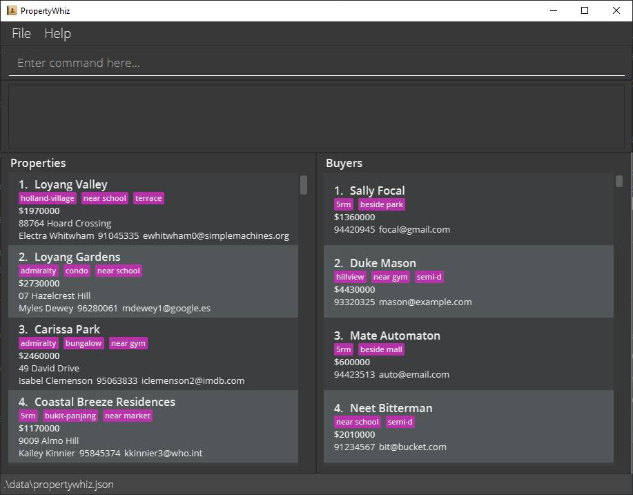
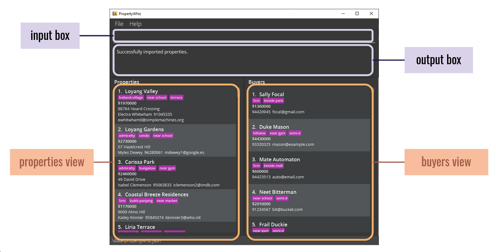
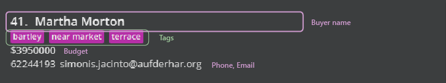
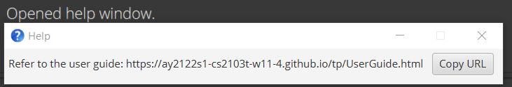
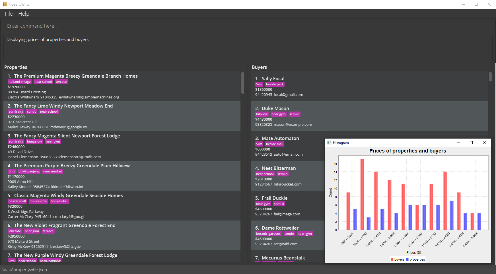
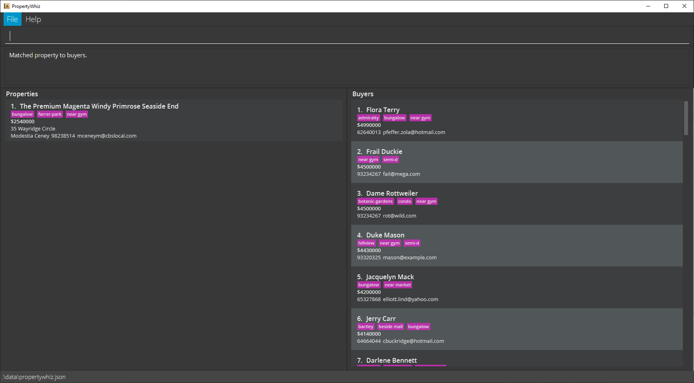

* Table of Contents
{:toc}

--------------------------------------------------------------------------------------------------------------------

## Introduction

PropertyWhiz is a **desktop app for managing properties and property buyers**, tailor made for property agents. PropertyWhiz is optimized for use via a [Command Line Interface (CLI)](#glossary) while still having the benefits of a [Graphical User Interface (GUI)](#glossary). PropertyWhiz has inbuilt data analysis features like chart generation, as well as smart matching features to pair up your properties and buyers. 

### Is this for me?

If you fit the descriptions below, then PropertyWhiz will address many of your important needs.
1. Do you face difficulties *managing client information on pen and paper*? PropertyWhiz handles the data required for your day to day work and makes sure that you enter them correctly.
2. Do you fumble with *finding where certain buttons are at when using general purpose software like Excel*? PropertyWhiz has a small and mentally manageable number of commands that fit on an A4 page. Furthermore, if you can type fast, PropertyWhiz can get your tasks done faster than traditional GUI apps.

### Purpose of this guide

This guide is
* a summary of all the *features* offered by PropertyWhiz, and a high level overview on how they operate so you can use this as a reference sheet.
* a high level overview of what *user input* is considered as valid so you can quickly get started with PropertyWhiz.

This guide is **not**
* an exhaustive case study of all possible ways of using PropertyWhiz's features.
* an exhaustive list of valid and invalid inputs as the application itself will hint you when your input is invalid.

--------------------------------------------------------------------------------------------------------------------

## How to use this guide
Thank you for investing some of your time to learn more about PropertyWhiz. We, the development team, are certain that your time is well-spent and will greatly improve your effectiveness in using PropertyWhiz.

Here are some tips on how to read this guide more efficiently, so that you will become a whiz in no time.
### Navigating the guide

1. First, you can read the [Quick Start](#quick-start) section to check the compatibility of your system with PropertyWhiz. We recommend that you download PropertyWhiz and follow along with the commands introduced in this guide. Practice makes perfect and it is the best way to learn PropertyWhiz!
2. Before going further, do have a glance at the [conventions](#conventions) on symbols and formatting used across this guide. If you see any unfamiliar terminology, fret not, for you can find an explanation in the [glossary](#glossary).
3. Now that you have had an initial look at PropertyWhiz, we have a detailed listing of the UI components [here](#navigating-the-user-interface).
   By this step, you may have already tried out some commands in the command box. If you haven't or don't know what the command box is, don't worry! The information is in the UI component listing.
4. Now you are ready to take a deeper dive into our commands. We have some [general guidelines](#valid-propertiesbuyers) on what user input is considered valid. Feel free to look through the detailed descriptions of our [commands](#commands).
5. We have tried our best to make the command format as intuitive and unambiguous as possible. If you have doubts, do refer to our [detailed guide](#command-syntax-guide) on command syntax.

### Conventions

Symbols | Meaning
--------|------------------
:information_source: | This is general information that improves your background understanding of this guide as well as PropertyWhiz.
:bulb: | This is additional (but not crucial) information that may help you to use PropertyWhiz more effectively.
:exclamation: | This is something important that you should be aware of.


Formatting | Meaning
--------|------------------
*italics* | This is used to give slight emphasis to certain words.
**boldface** | This is used to emphasize certain words, for instance restrictions on input. The degree of emphasis is stronger than *italics*.
`code` | This is used to denote user input or names of files used by the PropertyWhiz.

### Glossary

Word | Meaning
-----|------------------
Command Line Interface (CLI) | Text based user interface.
Graphical User Interface (GUI) | User interface that allows users to interact via mouse and graphics.

--------------------------------------------------------------------------------------------------------------------

## Quick start

<div markdown="block" class="alert alert-info">

**:information_source: Supported platforms:**<br>
PropertyWhiz has been extensively tested on Microsoft Windows 10 and Ubuntu 20.04. However, recent versions of Windows and GNU Linux are also likely to work.

</div>

1. Ensure you have Java `11` or above installed in your Computer.

2. Download the latest `propertywhiz.jar` from [here](https://github.com/AY2122S1-CS2103T-W11-4/tp/releases).

3. Copy the file to the folder you want to use as the _home folder_ for your PropertyWhiz.

4. Double-click the file to start the app. The GUI similar to the below should appear in a few seconds. Note how the app contains some sample data.<br>
    
   
   
5. Type the command in the command box and press Enter to execute it. e.g. typing **`help`** and pressing Enter will open the help window.<br>
   Some example commands you can try:

    * **`clear`** : Deletes all properties/buyers. Enter `clear` to start from scratch!

    * **`list`** : Lists all properties/buyers.

    * **`add`** Adds a property/buyer.
        * e.g. `add property n/Blk 123 a/123, Clementi Rd, #04-20, 1234665 s/James Lee p/61234567 e/example@email.com $/100000 t/HDB t/3rm`

    * **`delete`** : Deletes a property/buyer shown in the current list at the given index.
        * e.g. `delete property 3`
        * e.g. `delete buyer 3`

    * **`exit`** : Exits the app.

6. Refer to the [Commands](#commands) below for details of each command, 
   or the [Command Summary](#command-summary).

--------------------------------------------------------------------------------------------------------------------


## Command summary

Refer to the section [Command Syntax Guide](#command-syntax-guide) below for how to interpret our commands, 
or [Commands](#commands) for a more detailed version of each action.

Action | Format, Examples
--------|------------------
**Add** | **Property** <br>`add property n/PROPERTY_NAME a/PROPERTY_ADDRESS s/SELLER_NAME p/SELLER_PHONE e/SELLER_EMAIL $/PRICE [t/TAG]…​` <br><br> **Buyer** <br>`add buyer n/BUYER_NAME p/BUYER_PHONE e/BUYER_EMAIL $/BUDGET) [t/TAG]…`
**Clear** | `clear`
**Delete** | `delete (property | buyer) INDEX`
**Edit** | **Property** <br>`edit property INDEX [n/PROPERTY_NAME] [a/PROPERTY_ADDRESS] [s/SELLER_NAME] [p/SELLER_PHONE] [e/SELLER_EMAIL] [$/PRICE] [([t/TAG]…​ | [ta/TAG_TO_ADD]… [td/TAG_TO_DELETE]…)]]​`<br><br> **Buyer** <br> `edit buyer INDEX [n/BUYER_NAME] [p/BUYER_PHONE] [e/BUYER_EMAIL] [$/BUDGET]) [([t/TAG]… | [ta/TAG_TO_ADD]… [td/TAG_TO_DELETE]…)]`
**Find** | `find (property | buyer) [KEYWORDS] [t/TAG_TO_MATCH]…`
**List** | `list`
**Exit** | `exit`
**Help** | `help`
**Sort** | `sort (property | buyer) (price | name) (asc | desc)`
**Match** | `match (auto | property INDEX | buyer INDEX)`
**Import** | `import (property | buyer)`
**Export** | `export (property | buyer)`

--------------------------------------------------------------------------------------------------------------------

## Navigating the User Interface



The UI is split into the input and output sections, as well as
two view columns for **Property** and **Buyer** each.

Item | Description
--------|------------------
**Input box** | Also known as the command box, this is PropertyWhiz's command line. All typed input goes here. <br> :bulb: For an *unsuccessful* command, the input will be colored <span style="color:red">red</span>.
**Output box** | The output box displays additional information from a command. <br> :bulb: For a *successful* command, the output box may show metadata like number of entries listed. <br> :bulb: For an *unsuccessful* command, such as invalid input, the output box will give detailed feedback about which part of the command is invalid and how to fix it.
**Properties view** | A listing of properties.
**Buyers view** | A listing of buyers.


Here is the breakdown of an individual *property card*.

Item | Description
--------|------------------
**Name** | Name of property listing.
**Tags** | Tags describing notable qualities of the property.
**Price** | Quoted price of seller.
**Address** | Address of property listing.
**Seller** | Name of seller.
**Phone** | Phone number of seller.
**Email** | Email of seller.



Here is the breakdown of an individual *buyer card*.

Item | Description
--------|------------------
**Name** | Name of buyer.
**Tags** | Tags describing desirable qualities of a property the buyer is looking out for.
**Budget** | The buyer's budget.
**Phone** | Phone number of buyer.
**Email** | Email of buyer.

--------------------------------------------------------------------------------------------------------------------

## Command Syntax Guide

* The action keywords `property`, `properties` can both be used to refer to properties, and similarly for `buyer` and `buyers` as well.
  * e.g. `find property Condo` can also be entered as `find properties Condo`.

* Words in `UPPER_CASE` must be supplied by the user.<br>
  * e.g. in `add property n/PROPERTY_NAME`, `PROPERTY_NAME` is a parameter which can be used as `add property n/Beautiful Condo`.

* `[]` : Items in square brackets are optional.<br>
  * e.g `n/PROPERTY_NAME [t/TAG]` can be used as `n/Beautiful Condo t/condo` or as `n/Beautiful Condo`.

<div markdown="span" class="alert alert-warning">:exclamation: **Caution:**
There is one exception to this optional parameter syntax.

Under the [`find` command](#locating-propertiesbuyers-by-name-tags-price-find), while each individual argument is optional, it is not valid to leave out all arguments. For example, `find properties` alone is invalid. See the [`find` command](#locating-propertiesbuyers-by-name-tags-price-find) for more detailed examples.

</div>

* `…` : Items with `…` after them can be repeated any number of times.<br>
  * e.g. `[t/TAG]…` can be omitted, used once:`t/condo`, twice:`t/condo t/family` or more times.

* `( | )` : Items in circle brackets `()` separated by `|` means that you can only choose 1 of the partitioned items <br>
  * e.g. `([t/TAG] | [ta/TAG_TO_ADD] [t/TAG_TO_DELETE])` can be used as `t/condo`, `ta/condo td/small condo` but not `t/condo ta/condo`, `t/condo td/small condo`, `t/condo ta/condo td/small condo`

* Parameters can be in any order.<br>
  * e.g. if the command specifies `n/NAME p/PHONE_NUMBER`, `p/PHONE_NUMBER n/NAME` is also acceptable.

* Our commands use slashes `/` as prefix identifiers, so do not use `/` in command arguments.
  * e.g. `edit property 3 s/Anish s/o Reyaz` will result in an error message displayed in the output box.

* Extraneous parameters for commands that do not take in parameters (such as `help`, `list`, `exit` and `clear`) will be ignored.<br>
  * e.g. if the command specifies `help 123`, it will be interpreted as `help`.

------------------

## Valid properties/buyers
Here are some fields that are shared amongst commands.

### Property/Buyer names: `n/`
* Names must start with a letter or number, and only contain alphanumerical characters, spaces and hyphens (`-`).
* Names have a maximum allowed length of 50.
* Buyers with identical names are not allowed.

### Property addresses: `a/`
* Addresses must start with a letter or number, and only contain alphanumerical characters, and the following special characters:
  * spaces,
  * hyphens (`-`),
  * commas (`,`),
  * semicolons (`;`),
  * and hashes (`#`).
* Addresses have a maximum allowed length of 100.
* Properties with identical addresses are not allowed.

### Property Prices/Buyer Budget: `$/`
* Prices must be between 4 and 9 digits (both inclusive).
* Leading zeroes will be ignored. For e.g., `00100` has 5 characters, but it only has 3 digits, not counting the leading 0s. Hence, `00100` is an invalid price.

### Phone numbers: `p/`
* Phone number should only contain alphanumeric characters, hyphens (`-`), parentheses (`()`), plus signs (`+`) and spaces.
* Phone numbers must have at least 3 characters, excluding leading and trailing spaces
  * Valid: 
    * `9123 4567`
    * `(office) +65 6123 4567`
    * `nil`
  * Invalid: 
    * <code>&nbsp;&nbsp;&nbsp;a&nbsp;&nbsp;&nbsp;</code> (Excluding leading and trailing spaces, the phone number only contains 1 character)
    * `#123` (contains invalid hash symbol)

### Tags: `t/`, `ta/`, `td/`
* Tags are always optional.
* Tags must start with a letter or number, and only contain alphanumerical characters, spaces and hyphens (`-`).
* Tags have a maximum allowed length of 100.

------------------
## Commands

<div markdown="span" class="alert alert-primary">:bulb: **Tip:**

Don't worry if your first few commands fail! PropertyWhiz's [output box](#navigating-the-user-interface) gives very detailed feedback on which parts of your input is invalid!

</div>

### Viewing help : `help`

Shows a message explaining how to access the help page.



Format: `help`


### Adding a property/buyer: `add`

Adds a property/buyer to PropertyWhiz.

* All other fields are compulsory other than tags.

See the section [Valid properties/buyers](#valid-propertiesbuyers) for details on constraints on what you can enter.

Format:
* Adding a property: `add property n/PROPERTY_NAME a/PROPERTY_ADDRESS s/SELLER_NAME p/SELLER_PHONE e/SELLER_EMAIL $/PRICE [t/TAG]…`
* Adding a buyer: `add buyer n/BUYER_NAME p/BUYER_PHONE e/BUYER_EMAIL $/BUDGET [t/TAG]…`

Examples:
* `add property n/Blk 123 a/123, Clementi Rd, #04-20, 1234665 s/James Lee p/61234567 e/james@email.com $/100000 t/hdb t/3rm`
* `add property n/Blk 321 a/123, Clementi Rd, #04-20, 1234665 s/James Lee p/(hp) 61234567 e/james@email.com $/100000 t/hdb t/3rm`
* `add buyer n/Sam p/91234567 e/sam@email.com $/740000 t/hdb t/3rm`

<div markdown="span" class="alert alert-primary">:bulb: **Tip:**
A property/buyer can have any number of tags (including 0). All tags will be converted to lowercase.
</div>


### Listing all properties/buyers : `list`

Shows a list of all properties and buyers in PropertyWhiz.

Format: `list`


### Editing a property/buyer : `edit`

Edits the property/buyer at the specified `INDEX`. The index refers to the index number shown in the displayed property/buyer list. The index **must be a positive integer** 1, 2, 3, …
* At least one of the optional fields must be provided.
* Existing values will be updated to the input values.
* When editing tags, the existing tags of the property will be removed i.e adding of tags is not cumulative.
* Like `add`, tags added via `edit` will be automatically converted to lower case.
* You can remove all the property/buyer’s tags by typing `t/` without specifying any tags after it.

See the section [Valid properties/buyers](#valid-propertiesbuyers) for details on constraints on what you can enter.

Format:
* Editing a property: `edit property INDEX [n/PROPERTY_NAME] [a/PROPERTY_ADDRESS] [s/SELLER_NAME] [p/SELLER_PHONE] [e/SELLER_EMAIL] [$/PRICE] [([t/TAG]… | [ta/TAG_TO_ADD]… [td/TAG_TO_DELETE]…)]`
* Editing a buyer: `edit buyer INDEX [n/BUYER_NAME] [p/BUYER_PHONE] [e/BUYER_EMAIL] [$/BUDGET] [([t/TAG]… | [ta/TAG_TO_ADD]… [td/TAG_TO_DELETE]…)]`

Examples:
* `edit property 1 p/91234567 e/johndoe@example.com`
  * Edits the phone number and email address of the 1st property to be `91234567` and `johndoe@example.com` respectively.
* `edit property 2 n/Blk 298 Toa Payoh Central t/` 
  * Edits the name of the 2nd property to be `Blk 298 Toa Payoh Central` and clears all existing tags.
* `edit buyer 1 p/91234567 e/johndoe@example.com` 
  * Edits the phone number and email address of the 1st buyer to be `91234567` and `johndoe@example.com` respectively.
* `edit property 1 ta/4rm ta/near mrt` 
  * Edits the tag list of the 1st property by adding two tags called "4rm" and "near mrt" if they are not already present in the original tag list.
* `edit property 1 ta/4rm td/near mrt`
  * Edits the tag list of the 1st property by adding a tag called "4rm" if it does not already exist in the original tag list and removing a tag called "near mrt" if it is present in the original tag list.
* `edit buyer 1 ta/near MRT`
  * Edits the tag list of the 1st buyer by adding a tag called `near mrt` if it does not already exist in the original tag list. Notice that the case of `MRT` is lowered to `mrt`.

<div markdown="span" class="alert alert-warning">:exclamation: **Caution:**
The following example is invalid:

`edit property 1 t/near school ta/4rm td/near mrt` You cannot reset the tag list of a property, in this case to ["near school"], *and* modify the resetted tag list by adding a tag called "4rm" and removing a tag called "near mrt". The rationale is that this may be potentially confusing.

</div>


### Viewing price chart of listed properties and/or buyers : `stat`

Creates a pop-up with the price chart of the currently listed properties and/or buyers in the view.

Format: 
* View price chart of properties and buyers: `stat` 
* View price chart of properties: `stat property`
* View price chart of buyers: `stat buyer`


<div markdown="span" class="alert alert-primary">:bulb: **Tip:**
If only buyers or only properties are visible, `stat` automatically presents the only buyers/only properties view.
</div>

### Locating properties/buyers by name, tags, price: `find`

Finds properties or buyers whose names contain any of the given keywords, whose tag list contain all of the specified tags and whose price is within the specified price range in the **currently displayed list**.

Format: `find (property | buyer) [KEYWORDS] [t/TAG_TO_MATCH]… [$min/MIN_PRICE] [$max/MAX_PRICE]`

* Finds only properties or buyers in the currently displayed list
  * e.g. If `find property hillview` return properties `Hillview` and `Hillview Rise`, then applying another find command `find property grove` will return an empty list, even if PropertyWhiz has a property `Grove`.
* The keyword search is case-insensitive. e.g. `hillview` will match `Hillview`
* The order of the keywords does not matter. e.g. `Hillview Rise` will match `Rise Hillview`
* Only full words will be matched e.g. `Hill` will not match `Hillview`
* The tag search is case-insensitive, e.g. both `t/mrt`, `t/MRT` will match the `mrt` tag.
* Properties/buyers matching at least one keyword will be returned.
    * e.g. `find property Hillview Rise` will return properties `Hillview Grove`, `Rise Rivervale`
* Only properties/buyers that match all the tags will be returned.
    * e.g. `find property t/4rm t/near school` will return properties with both `4rm` tag, and `near school` tag.
* The price search is inclusive of the specified number.
  * e.g. `find property $min/10000` will return properties that are at least $10000
  * e.g. `find property $max/100000` will return properties that are at most $100000
* Only one `$min/` and `$max/` is allowed in the input
  * e.g. `find property $min/1000 $max/100000` is valid
  * e.g. `find property $min/10000 $min/1999999 $max/100000` is invalid
  
Examples:
* `find property Jurong`
  * Returns properties `jurong` and `Jurong East`
* `find buyer Sally` 
  * Returns buyers `sally` and `Sally Brown`
* `find property Jurong t/4rm t/near school` 
  * Returns properties `jurong [4rm] [near school] [near mrt]` and `Jurong East [4rm] [near school] [near mrt]` but not `jurong [4rm] [near mrt]`
* `find property t/4rm t/near school` 
  * Returns properties `jurong [4rm] [near school] [near mrt]` and `Clementi [4rm] [near school] [near mrt]`
* `find buyer Sally t/4rm t/near school` 
  * Returns buyers `Sally [4rm] [near school] [quiet]` and `sally brown [4rm] [near school]`
* `find property $min/10000 $max/1000000` 
  * Returns properties that are at least $10000 and at most $1000000

<div markdown="span" class="alert alert-warning">:exclamation: **Caution:**

As mentioned in the [syntax guide](#command-syntax-guide), `find` is an exception to the optional parameter syntax. While each of `[KEYWORDS] [t/TAG_TO_MATCH]… [$min/MIN_PRICE] [$max/MAX_PRICE]` are listed as optional, it is invalid to leave out all of them.

Examples of invalid usages of `find` are: `find properties` and `find buyers`.

</div>

<div markdown="span" class="alert alert-primary">:bulb: **Tip:**

You can use the `list` command to reset all the filters and view all the properties and buyers in `PropertyWhiz`.

</div>

### Deleting a property/buyer : `delete`

Deletes the specified property/buyer from PropertyWhiz.

Format: `delete (property | buyer) INDEX`

* Deletes the property/buyer at the specified `INDEX`.
* The index refers to the index number shown in the displayed property/buyer list.
* The index **must be a positive integer** 1, 2, 3, …

Examples:
* `list` followed by `delete property 2` deletes the 2nd property in PropertyWhiz.
* `find East Coast` followed by `delete property 1` deletes the 1st property in the results of the `find` command.

### Sorting properties/buyers: `sort`

Sorts the properties / buyers in PropertyWhiz.

Format: `sort (property | buyer) (price | name) (asc | desc)`

* Sort the properties in the **current** view based on properties `price`/`name` in `asc`(ascending) / `desc`(descending) order
* Sort the buyers in the **current** view based on buyers `price`/`name` in `asc`(ascending) / `desc`(descending) order

Examples:

* `sort property price asc` 
  * Returns the property list sorted by price in ascending order
* `sort buyer name desc` 
  * Returns the buyer list sorted by name in descending order

### Matching properties and buyers: `match`

Matches properties and buyers to one another.

Format: `match (auto | property INDEX | buyer INDEX)`

#### One to many matching of property to buyers



Matches compatible buyers to a specified property, displayed in descending order of desirability.

Format: `match property INDEX`

* A buyer is compatible with a property if the buyer's budget is greater than or equal to the property's selling price.
* When 2 buyers, say `A` and `B` are both compatible with a property, then `A` is more desirable than `B` if `A` has more tags in common with the property than `B`. This is because a buyer's tags represents what the buyer would want in a property, and a property's tags represents the features the property has to offer.
* When 2 buyers have the same number of tags in common with a property, the buyer with a higher budget is ranked higher in desirability.

<div markdown="span" class="alert alert-warning">:exclamation: **Caution:**

The matching is done on the currently displayed buyer list. In other words, if you have filtered buyers for example, using the `find` command, then the potential matches for `match property 1` (the first displayed property) will only come from the filtered buyer list.

To illustrate, suppose you have 5 buyers in total (Adam, Ben, Carl, Daniel, Elle), and you have filtered the buyers to 3 (Adam, Ben, Carl). Then `match property 1` will only examine the 3 buyers (Adam, Ben, Carl). Even if Daniel or Elle is compatible with the first displayed property, they will not be considered in the matching.

</div>

<div markdown="span" class="alert alert-primary">:bulb: **Tip:**
You can use the `list` command to reset the display lists to display all the available buyers before using `match property`. This will find compatible buyers from the full pool of available buyers.
</div>

Example:
* `match property 2` will match all displayed buyers with the second displayed property. Suppose the second displayed property has a selling price of `1,000,000` and has tags `4rm`, `near school`.
  * Price Compatibility:
    * Compatible buyers: 
      * All buyers whose budget is at least `1,000,000` 
      * e.g. A buyer whose budget is `1,100,000` is compatible
    * Incompatible buyers: 
      * All buyers whose budget is lower than `1,000,000` 
      * e.g. A buyer whose budget is `900,000` is not compatible
  * Tag Compatibility:
    * Suppose we have 3 buyers:
      * Richard has tags `5rm`, `far from school`
      * Sam has tag `4rm`
      * Tim has tags `4rm`, `near school`
    * Order of tag compatibility (most to least compatible): Tim, Sam, Richard. 
    * Tim has the greatest number of tags in common and is the most desirable buyer match, whereas Richard has the least number of tags in common and is the least desirable buyer match.

#### One to many matching of buyer to properties

Matches compatible properties to a specified buyer, displayed in descending order of desirability.

Format: `match buyer INDEX`

* A property is compatible with a buyer if the property's selling price is lower than the buyer's budget, i.e. the property is within the budget of the buyer.
* When 2 properties, say `A` and `B` are both compatible with a buyer, then `A` is more desirable than `B` if `A` has more tags in common with the buyer than `B`.
* When 2 properties have the same number of tags in common with a buyer, the property with a lower selling price is ranked higher in desirability, in other words, cheaper is better.
* Similar to `match property`, the matching for `match buyer` is done on the currently displayed property list. You can use the `list` command to reset the display lists to display all the available properties before using `match buyer`.

Example:
* `match buyer 2` will match all displayed properties with the second displayed buyer. Suppose the second displayed buyer has budget of `1,000,000` and has tags `4rm`, `near school`.
    * Budget Compatibility:
        * Compatible properties: 
          * All properties with selling price at most `1,000,000` 
          * e.g. A property with selling price of `900,000` is compatible
        * Incompatible properties: 
          * All properties with selling price larger than `1,000,000` 
          * e.g. A property with selling price of `1,100,000` is not compatible
    * Tag Compatibility:
        * Suppose we have 3 properties:
            * Dee Gardens has tags `5rm`, `far from school`
            * Olive Gardens has tag `4rm`
            * Pear Gardens has tags `4rm`, `near school`
        * Order of tag compatibility (most to least compatible): Pear Gardens, Olive Gardens, Dee Gardens.
        * Pear Gardens has the greatest number of tags in common and is the most desirable property match, whereas Dee Gardens has the least number of tags in common and is the least desirable property match.

#### Intelligent matching of properties and buyers


The `match auto` command instructs PropertyWhiz to automatically match buyers to properties.

Upon entering `match auto`, PropertyWhiz will intelligently pair properties with buyers based on their compatibility. The matches will then be displayed to you starting with the most compatible pairings at the top.

PropertyWhiz determines compatibility based on the number of tags in common, the buyer's budget, as well as the property price. Matches where the buyer and property have more tags in common are considered more compatible. Likewise for matches where the property price is within the buyer's budget.

After running `match auto`, enter `back` into the command box to return to the previously shown list of buyers and properties.

### Importing data from csv file : `import`

Imports buyers or properties from csv file. Imported items will be added to the front of the **currently displayed list**.

Format: `import (buyer | property)`

* You can select the import file location from a pop-up dialog box.
* The buyer or property list imported must be [valid](#valid-propertiesbuyers). Some criteria are as follows:
  * No duplicates
  * Valid fields e.g. name, email etc.
  * No missing fields
* The csv must begin with a header which includes the names of each column.

See [below](#exporting-data-to-csv-file--export) for example csv files.

### Exporting data to csv file : `export`

Exports buyers or properties in the **currently displayed list** to csv file.

Format: `export (buyer | property)`

* You can select the export file location from a pop-up dialog box.

Example csv output of  `export property`
<a name="csvExample"> </a>
```
"Name","Address","Seller Name","Phone","Email","Price","Tags"
"Geylang St 29","Blk 30 Geylang Street 29, #06-40","Alex Yeoh","87438807","alexyeoh@example.com","419999","flowers,garden"
"Dee Gardens","Blk 30 Lorong 3 Serangoon Gardens, #07-18","Beatrice Yu","99272758","berniceyu@example.com","420000","quiet"
"Olive Gardens","Blk 11 Ang Mo Kio Street 74, #11-04","Charlotte Oliveiro","93210283","charlotte@example.com","420001","cathedral"
"Pear Gardens","Blk 436 Serangoon Gardens Street 26, #16-43","David Li","91031282","lidavid@example.com","420002","near cbd"
"Tampa Bay","Blk 47 Tampines Street 20, #17-35","Irfan Ibrahim","92492021","irfan@example.com","420003","noisy,party"
```

Example csv output of `export buyer`
```
"Name","Phone","Email","Budget","Tags"
"Sally Focal","94420945","focal@gmail.com","419999","flowers,near school,garden"
"Duke Mason","93320325","mason@example.com","420000","4rm"
"Mate Automaton","94423513","auto@email.com","420001","near cdb"
"Neet Bitterman","91234567","bit@bucket.com","420002","huge house,noisy,party"
"Frail Duckie","93234267","fail@mega.com","420003","tiny,1rm"
```

<div markdown="span" class="alert alert-primary">:bulb: **Tip:**
Try copying these to a .csv file. Then import them as sample inputs!
</div>

### Clearing all entries : `clear`

Clears all entries from PropertyWhiz.

Format: `clear`

### Exiting the program : `exit`

Exits the program.

Format: `exit`

### Saving the data

PropertyWhiz's data are saved in the hard disk automatically after any command that changes the data. There is no need to save manually.

------------------

## Advanced features

This section contains features intended for advanced users.

### Editing the data file

PropertyWhiz's data are saved as a JSON file `[JAR file location]/data/propertywhiz.json`. Advanced users are welcome to update data directly by editing that data file.

<div markdown="span" class="alert alert-warning">:exclamation: **Caution:**
If your changes to the data file makes its format invalid, PropertyWhiz will discard all data and start with an empty data file at the next run.
</div>

### Multi-command input

You may copy and paste multiple lines of commands into the command box. Press the Enter key to execute the first command and autofill the next into the command box. This continues until you enter a different command or all commands have been executed.

--------------------------------------------------------------------------------------------------------------------

## FAQ

**Q**: How do I transfer my data to another Computer?<br>
**A**: Install the app in the other computer and overwrite the empty data file it creates with the file that contains the data of your previous PropertyWhiz home folder.
